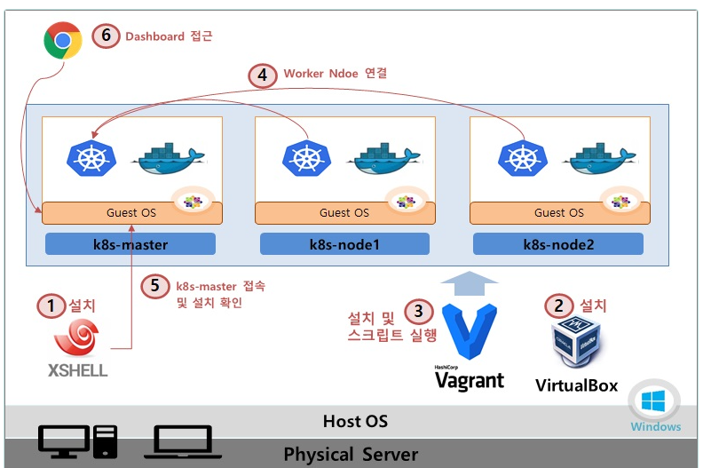
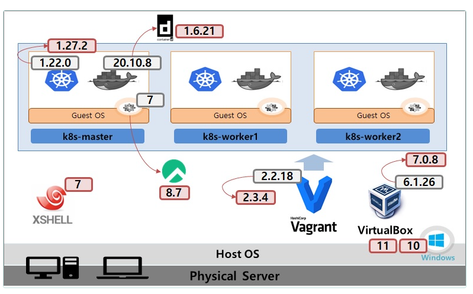
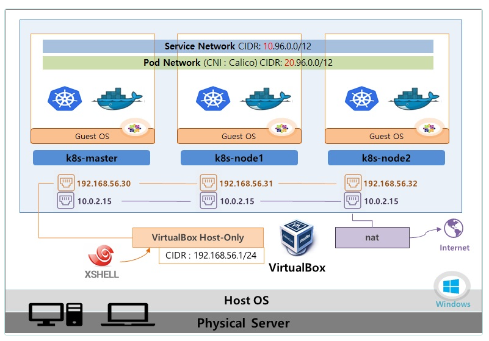

# 설치 가이드
  
1.XShell 설치 : 생성될 Master/Woker Node에 접속할 툴 (기존에 쓰고 있는게 있으면 생략가능)

2.VirtualBox 설치 : VM 및 내부 네트워크 생성 툴

3.Vagrant 설치 및 k8s 설치 스크립트 실행 : 자동으로 VirtualBox를 이용해 VM들을 생성하고, K8S관련 설치 파일들이 실행됨

4.Worker Node 연결 : Worker Node들을 Master에 연결하여 쿠버네티스 클러스터 구축

5.설치 확인 : Node와 Pod 상태 조회

6.대시보드 접근 : Host OS에서 웹 브라우저를 이용해 클러스터 Dashboard에 접근





1. XShell 설치
    - 다운로드 url : https://www.netsarang.com/en/free-for-home-school/
    - 설치 후 k8s-master(192.168.56.30:22), k8s-worker1(192.168.56.31:22), k8s-worker2(192.168.56.32:22) IP 등록

2. Virtualbox 설치
    - Download : https://download.virtualbox.org/virtualbox/7.1.6/VirtualBox-7.1.6-167084-Win.exe
    - Site : https://www.virtualbox.org/wiki/Downloads
    - visual c++ 관련 패키지를 먼저 설치하라는 팝업 나올땐 아래 링크에서 파일 설치하세요
      > visual C++패키지 사이트 : https://learn.microsoft.com/ko-kr/cpp/windows/latest-supported-vc-redist?view=msvc-170
      
      > [Win 10, 11용] 바로다운 링크 : https://aka.ms/vs/17/release/vc_redist.x64.exe

3. Vagrant 설치 및 k8s 설치 스크립트 실행

    3-1) Vagrant 설치 
      - Win 버전 : https://releases.hashicorp.com/vagrant/2.4.3/vagrant_2.4.3_windows_amd64.msi
      - Download site : https://developer.hashicorp.com/vagrant/downloads?product_intent=vagrant

    3-2) Vagrant 명령 실행

    - 윈도우에서 cmd 실행
    - k8s 폴더 생성 및 이동
    - Vagrantfile 파일 다운로드

```cmd
      // 폴더 생성
       C:\2025-01-JAVA-DEVELOPER-159\deploy_k8s> mkdir k8s
       C:\2025-01-JAVA-DEVELOPER-159\deploy_k8s>cd k8s 
      
       // Vagrant 스크립트 다운로드
       C:\2025-01-JAVA-DEVELOPER-159\deploy_k8s\k8s> curl -O https://raw.githubusercontent.com/k8s-1pro/install/main/under-thesea/k8s-cluster-1.27/vagrant-2.4.3/Vagrantfile
      
      // Rocky Linux Repo 세팅
      C:\2025-01-JAVA-DEVELOPER-159\deploy_k8s\k8s> curl -O https://raw.githubusercontent.com/k8s-1pro/install/main/under-thesea/k8s-cluster-1.27/vagrant-2.4.3/rockylinux-repo.json
      C:\2025-01-JAVA-DEVELOPER-159\deploy_k8s\k8s> vagrant box add rockylinux-repo.json
      
      // Vagrant Disk 설정 Plugin 설치 
      C:\2025-01-JAVA-DEVELOPER-159\deploy_k8s\k8s> vagrant plugin install vagrant-vbguest vagrant-disksize
```

 - Vagrant 실행 (5~10분 소요)
  
```cmd
C:\2025-01-JAVA-DEVELOPER-159\deploy_k8s\k8s> vagrant up
``` 
[vagrant 명령어 참고]

```cmd
    vagrant up : VM 생성 및 스크립트 설치
    (최초 VM생성 할때만 사용 합니다. 생성 이후 부터 VM 기동/중지는 Virtualbox UI를 사용하는걸 권해 드려요.)
    vagrant destroy : 가상머신 삭제
    (vagrant up으로 VM 생성 중 에러가 났을 때 이 명령으로 삭제 합니다.)
```
4. Worker Node 연결

    4-1) XShell을 통해 master 접속 (id/pw: root/vagrant)
   
    4-2) kubeadm으로  token 발급 및 복사

```bash
  [root@k8s-master ~]# kubeadm token create --print-join-command
kubeadm join 192.168.56.30:6443 --token bver73.wda72kx4afiuhspo --discovery-token-ca-cert-hash sha256:7205b3fd6030e47b74aa11451221ff3c77daa0305aad0bc4a2d3196e69eb42b7
```
  * join.sh 파일은 생성되지 않고 직접 위 kubeadm token 명령으로 토큰을 생성하시면 됩니다.

    4-3) worker node1 접속 후 토큰 붙여놓기 (id/pw: root/vagrant)
    
```bash
    [root@k8s-node1 ~]# kubeadm join 192.168.56.30:6443 --token bver73.wda72kx4afiuhspo --discovery-token-ca-cert-hash sha256:7205b3fd6030e47b74aa11451221ff3c77daa0305aad0bc4a2d3196e69eb42b7
```
 4-4) worker node2 접속 후 토큰 붙여놓기 반복

 ```bash
   [root@k8s-node2 ~]# kubeadm join 192.168.56.30:6443 --token bver73.wda72kx4afiuhspo --discovery-token-ca-cert-hash sha256:7205b3fd6030e47b74aa11451221ff3c77daa0305aad0bc4a2d3196e69eb42b7
 ```

5. 설치 확인

    5-1) XShell을 통해 master 접속 (id/pw = root/vagrant)

    5-2) kubectl 명령어

 ```bash
    [root@k8s-master ~]# kubectl get pod -A
    [root@k8s-master ~]# kubectl get nodes
 ```

6. 대시보드 접근

 ```
    https://192.168.56.30:30000/#/login
 ```

참고
Version 정보 





Network 구성도



<hr>


