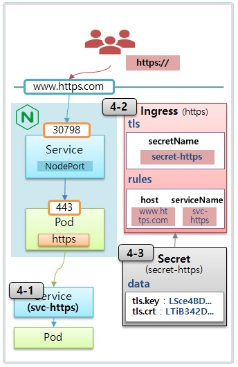

# Ingress - Service Loadbalancing, Canary Upgrade


  ## 1. Nginx Controller
  
  

- Nginx와 같은 Ingress Controller 컨트롤러를 별도로 설치하지 않으면, 아무리 쿠버네티스 내에 Ingress를 만들어도 동작하지 않음
- Nginx는 쿠버네티스 내에 Ingress가 만들어지면 해당 Rule을 읽고, 그 Rule에 따라 트래픽을 분배해주는 역할
- 그렇기 때문에 분배시키려는 트래픽은 반드시 Nginx로 보내야 함


   ### 1-1) Nginx 설치
```bash
kubectl apply -f https://raw.githubusercontent.com/k8s-1pro/install/refs/heads/main/ground/k8s-1.27/nginx-1.8.2/nginx-controller.yaml
```


   ### 1-2) NodePort Service 생성
  
  ```
  Service(NodePort) 와 Port(30431, 30798) 설정은 위 배포 파일에 포함되어 있습니다.
  ```

  ## 2. Service Loadbalancing
  
  


   ### 2-1) Shopping Page
```yml   
apiVersion: v1
kind: Pod
metadata:
  name: pod-shopping
  labels:
    category: shopping
spec:
  containers:
  - name: container
    image: itwillacademy/shopping
---
apiVersion: v1
kind: Service
metadata:
  name: svc-shopping
spec:
  selector:
    category: shopping
  ports:
  - port: 8080
```

   ### 2-2) Customer Center
```yml   
apiVersion: v1
kind: Pod
metadata:
  name: pod-customer
  labels:
    category: customer
spec:
  containers:
  - name: container
    image: itwillacademy/customer
---
apiVersion: v1
kind: Service
metadata:
  name: svc-customer
spec:
  selector:
    category: customer
  ports:
  - port: 8080
```

   ### 2-3) Order Service
```yml
apiVersion: v1
kind: Pod
metadata:
  name: pod-order
  labels:
    category: order
spec:
  containers:
  - name: container
    image: itwillacademy/order
---
apiVersion: v1
kind: Service
metadata:
  name: svc-order
spec:
  selector:
    category: order
  ports:
  - port: 8080
```

   ### 2-4) Ingress
v1.27
```yml
apiVersion: networking.k8s.io/v1
kind: Ingress
metadata:
  name: service-loadbalancing
spec:
  ingressClassName: nginx
  rules:
  - http:
      paths:
      - path: /
        pathType: Prefix
        backend:
          service:
            name: svc-shopping
            port:
              number: 8080
      - path: /customer
        pathType: Prefix
        backend:
          service:
            name: svc-customer
            port:
              number: 8080
      - path: /order
        pathType: Prefix
        backend:
          service:
            name: svc-order
            port:
              number: 8080
```


▶ Master에서 각 Service별 API 호출

- **Pod IP((pod-shopping,pod-customer,pod-order))로 요청**

```bash
[root@k8s-master sample]# curl 10.104.96.176:8080
Shopping Service.
[root@k8s-master sample]# curl 20.96.169.130:8080
Order Service.
[root@k8s-master sample]# curl 20.96.169.141:8080
Customer Service.
```

- **Service IP(svc-shopping,svc-customer,svc-order) 로 요청**

```bash
[root@k8s-master sample]# curl 10.104.96.176:8080
Shopping Service.
[root@k8s-master sample]# curl 10.106.22.103:8080
Customer Service.
[root@k8s-master sample]# curl 10.102.102.4:8080
Order Service.
```
- **Node IP( k8s-master,k8s-node1,k8s-node2 )로 요청**
```bash
[root@k8s-master sample]# curl 192.168.56.30:30431/
[root@k8s-master sample]# curl 192.168.56.31:30431/
[root@k8s-master sample]# curl 192.168.56.32:30431/
Shopping Service.
[root@k8s-master sample]# curl 192.168.56.30:30431/order
[root@k8s-master sample]# curl 192.168.56.31:30431/order
[root@k8s-master sample]# curl 192.168.56.32:30431/order
Order Service.
[root@k8s-master sample]# curl 192.168.56.30:30431/customer
[root@k8s-master sample]# curl 192.168.56.31:30431/customer
[root@k8s-master sample]# curl 192.168.56.32:30431/customer
Customer Service.


```

  ## 3. Canary Upgrade

  

​- Ingress에 annotation 설정을 통해 트래픽을 제어 할 수 있음
- Nginx가 해당 설정을 읽어서 트래픽을 조절하는 역할
- weight(10%) : 트래픽의 10%를 지정된 Pod로 보냄
- header : API Header를 보고 트래픽을 지정된 Pod로 보냄

   ### v3-1) App V1
```yml   
apiVersion: v1
kind: Pod
metadata:
  name: pod-v1
  labels:
    app: v1
spec:
  containers:
  - name: container
    image: itwillacademy/app:v1
    imagePullPolicy: Always
---
apiVersion: v1
kind: Service
metadata:
  name: svc-v1
spec:
  selector:
    app: v1
  ports:
  - port: 8080
```  
   ### 3-2) App V2
```yml   
apiVersion: v1
kind: Pod
metadata:
  name: pod-v2
  labels:
    app: v2
spec:
  containers:
  - name: container
    image: itwillacademy/app:v2
    imagePullPolicy: Always
---
apiVersion: v1
kind: Service
metadata:
  name: svc-v2
spec:
  selector:
    app: v2
  ports:
  - port: 8080
```

   ### 3-3) Ingress - default

v1.27

```yml
apiVersion: networking.k8s.io/v1
kind: Ingress
metadata:
  name: app
spec:
  ingressClassName: nginx
  rules:
  - host: www.app.com
    http:
      paths:
      - path: /
        pathType: Prefix
        backend:
          service:
            name: svc-v1
            port:
              number: 8080
```

▶ Master에 Hostname 등록 후 도메인으로 API 호출

```bash
# Centos HostName 등록
[root@k8s-master /]# 
cat << EOF >> /etc/hosts
192.168.56.30 www.app.com
EOF

[root@k8s-master /]# curl www.app.com:30431/version
Version : v1

```

   ### 3-4) Ingress - weight

v1.27

```yml
apiVersion: networking.k8s.io/v1
kind: Ingress
metadata:
  name: canary-v2
  annotations:
    nginx.ingress.kubernetes.io/canary: "true"
    nginx.ingress.kubernetes.io/canary-weight: "10"
spec:
  ingressClassName: nginx
  rules:
  - host: www.app.com
    http:
      paths:
      - path: /
        pathType: Prefix
        backend:
          service:
            name: svc-v2
            port:
              number: 8080
```

▶ API 호출시 10% 확률로 v2 호출 확인

- **10% 비율로 v2로 traffic 이전달**

```bash
[root@k8s-master /]# while true; do curl www.app.com:30431/version; sleep 1; done
Version : v1
Version : v1
Version : v1
Version : v1
Version : v1
Version : v1
Version : v1
Version : v1
Version : v1
Version : v2
Version : v1
.
.
```


   ### 3-5) Ingress - header

  ▶ 기존 Ingress(canary-v2) 삭제 후 아래 Ingress 생성

```yml
apiVersion: networking.k8s.io/v1
kind: Ingress
metadata:
  name: canary-kr
  annotations:
    nginx.ingress.kubernetes.io/canary: "true"
    nginx.ingress.kubernetes.io/canary-by-header: "Accept-Language"
    nginx.ingress.kubernetes.io/canary-by-header-value: "kr"
spec:
  ingressClassName: nginx
  rules:
  - host: www.app.com
    http:
      paths:
      - path: /
        pathType: Prefix
        backend:
          service:
            name: svc-v2
            port:
              number: 8080
```

```bash
[root@k8s-master ~]# curl -H "Accept-Language: kr" www.app.com:30431/version
Version : v2

```

## 4. Https



​- Ingress에 Secret으로 TLS를 연결할 수 있고, 그러면 해당 Pod에 연결하기 위해 외부에서는 https로 접근됨

  ### 4-1) App V1

```yml
apiVersion: v1
kind: Pod
metadata:
  name: pod-https
  labels:
    app: https
spec:
  containers:
  - name: container
    image: itwillacademy/app
---
apiVersion: v1
kind: Service
metadata:
  name: svc-https
spec:
  selector:
    app: https
  ports:
  - port: 8080
```

  ### 4-2) Ingress - TLS
  
  v1.27
```yml
apiVersion: networking.k8s.io/v1
kind: Ingress
metadata:
  name: https
spec:
  ingressClassName: nginx
  tls:
  - hosts:
    - www.https.com
    secretName: secret-https
  rules:
  - host: www.https.com
    http:
      paths:
      - path: /
        pathType: Prefix
        backend:
          service:
            name: svc-https
            port:
              number: 8080
```

  ### 4-3) Secret
  v1.27
```bash
# 인증서 생성
openssl req -x509 -nodes -days 365 -newkey rsa:2048 -keyout tls.key -out tls.crt -subj "/CN=www.https.com/O=www.https.com"

# Secret 생성
kubectl create secret tls secret-https --key tls.key --cert tls.crt
```

# Windows HostName 등록
파일 위치 : C:\Windows\System32\drivers\etc\hosts
192.168.56.30 www.https.com

# 브라우저에서 접속
https://www.https.com:30798/hostname


▶ 실습 후 모든 리소스 삭제 ​(Dashboard에서 리소스별 삭제 or Master Node에서 아래 명령 실행)

```bash
kubectl delete pod pod-shopping pod-customer pod-order pod-v1 pod-v2 pod-https
kubectl delete svc svc-shopping svc-customer svc-order svc-v1 svc-v2 svc-https
kubectl delete ingress service-loadbalancing app canary-v2 canary-kr https
```


<hr>
<hr>

# guest application
 
> guest-Ingress1.yaml

```yml   
apiVersion: v1
kind: Pod
metadata:
  name: pod-guest-v1
  labels:
    app: guest-v1
spec:
  containers:
  - name: container
    image: academyitwill/guest:v1
    imagePullPolicy: Always
---
apiVersion: v1
kind: Service
metadata:
  name: service-guest-v1
spec:
  selector:
     app: guest-v1
  ports:
  - port: 80
---
apiVersion: networking.k8s.io/v1
kind: Ingress
metadata:
  name: ingress-guest-v1
spec:
  ingressClassName: nginx
  rules:
  - http:
      paths:
      - path: /
        pathType: Prefix
        backend:
          service:
            name: service-guest-v1
            port:
              number: 80

``` 

> guest-Ingress2.yaml

```yml
apiVersion: v1
kind: Pod
metadata:
  name: pod-guest-v2
  labels:
    app: guest-v2
spec:
  containers:
  - name: container
    image: academyitwill/guest:v2
    imagePullPolicy: Always
---
apiVersion: v1
kind: Service
metadata:
  name: service-guest-v2
spec:
  selector:
    app: guest-v2
  ports:
  - port: 80
---
apiVersion: networking.k8s.io/v1
kind: Ingress
metadata:
  name: ingress-guest-v2
  annotations:
    nginx.ingress.kubernetes.io/canary: "true"
    nginx.ingress.kubernetes.io/canary-weight: "30"
spec:
  ingressClassName: nginx
  rules:
  - http:
      paths:
      - path: /
        pathType: Prefix
        backend:
          service:
            name: service-guest-v2
            port:
              number: 80
```

## command

```bash
# 최초 오브젝트 생성
kubectl create -f guest-Ingress1.yaml
# 수정후 적용
kubectl apply -f guest-Ingress1.yaml
# 대체
kubectl replace --force -f guest-Ingress1.yaml
# 삭제
kubectl delete -f guest-Ingress1.yaml
```


- **30% 비율로 v2로 traffic 이전달**
```bash
[root@k8s-master /]# while true; do curl 192.168.56.30:30431/version; sleep 1; done
Version : v1
Version : v1
Version : v1
Version : v1
Version : v1
Version : v1
Version : v2
Version : v2
Version : v1
Version : v2
.
.
```
