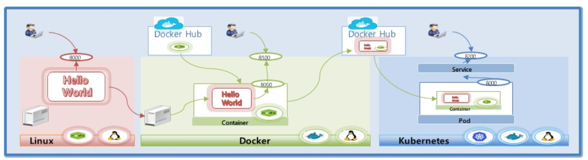
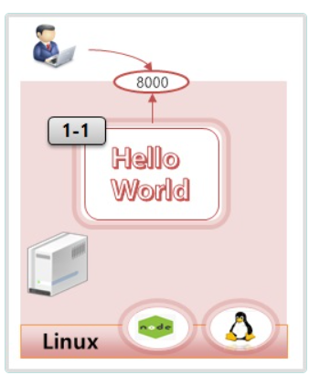
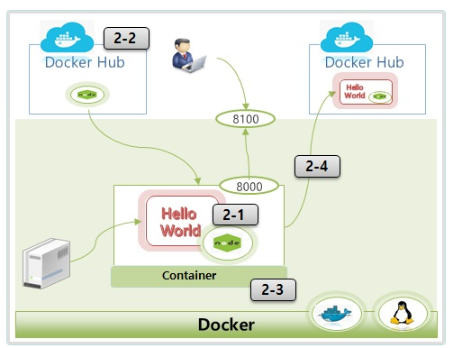

# Getting-Started Kubernetes!




1. Linux



> k8s-master CentOS에 nodejs 설치 :

```
    [root@k8s-master ~]# yum install epel-release
    [root@k8s-master ~]# yum -y install nodejs
    [root@k8s-master ~]# mkdir hello
    [root@k8s-master ~]# cd hello
    [root@k8s-master hello]# vi hello.js
        
        var http = require('http');
        var content = function(req, resp) {
            resp.end("Hello Kubernetes!" + "\n");
            resp.writeHead(200);
        }
        var w = http.createServer(content);
        w.listen(8000);
         
         1. vi hello.js 엔터키키
         2. hello.js내용을 복사한후 붙여넣기를한다
         3. :wq 를 입력한후 엔터키를 누른다.

    [root@k8s-master hello]#     


```

    1-1) hello.js

    ```
        var http = require('http');
        var content = function(req, resp) {
        resp.end("Hello Kubernetes!" + "\n");
        resp.writeHead(200);
        }
        var w = http.createServer(content);
        w.listen(8000);
    ```

    ```
    [root@k8s-master ~]# node hello.js
    ```


2. Docker



    2-1) Dockerfile

    ```
    FROM node:slim
    EXPOSE 8000
    COPY hello.js .
    CMD node hello.js
    ```

    ```
    [root@k8s-master hello]# vi Dockerfile

    FROM node:slim
    EXPOSE 8000
    COPY hello.js .
    CMD node hello.js

         1. vi Dockerfile 엔터키키
         2. Dockerfile내용을 복사한후 붙여넣기를한다
         3. :wq 를 입력한후 엔터키를 누른다.

    [root@k8s-master hello]# ls
    Dockerfile  hello.js


    2-2) Docker install
        
```
[root@k8s-master hello]# echo '======== 도커 설치 ========'
[root@k8s-master hello]# #https://download.docker.com/linux/centos/8/x86_64/stable/Packages/ 저장소 경로
[root@k8s-master hello]# yum install -y yum-utils
[root@k8s-master hello]# yum-config-manager --add-repo https://download.docker.com/linux/centos/docker-ce.repo
[root@k8s-master hello]# yum install -y docker-ce-3:23.0.6-1.el8 docker-ce-cli-1:23.0.6-1.el8 containerd.io-1.6.21-3.1.el8
systemctl daemon-reload
systemctl enable --now docker
```


    2-3) Docker Container Run

    ```
    [root@k8s-master hello]# docker build -t itwillacademy/hello .
    [root@k8s-master hello]# docker image ls
    [root@k8s-master hello]# docker run -d -p 8100:8000 --name hello_container itwillacademy/hello
    [root@k8s-master hello]# docker ps
    [root@k8s-master hello]# curl 127.0.0.1:8100
    [root@k8s-master hello]# docker exec -it hello_container /bin/bash
    ---------------container-------------
    root@47635a63b3b2:/# ls
    bin  boot  dev	etc  hello.js  home  lib  lib64  media	mnt  opt  proc	root  run  sbin  srv  sys  
    root@47635a63b3b2:/# exit 
    --------------------------------------
    [root@k8s-master hello]

    ```

    2-4) Docker Image Push

    ```
    docker logout
    docker login
    docker push itwillacademy/hello

    ```

        > 실습 참고사항
        > Image Push는 자신의 docker hub 계정이 있어야 실습 가능한 부분입니다. kubetm를 자신의 계정으로 변경해야합니다.