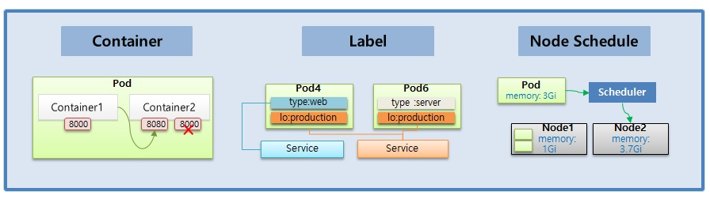
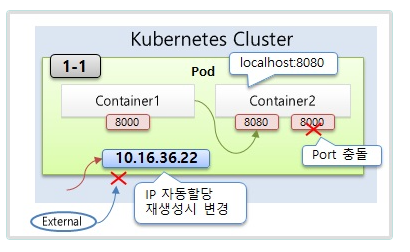
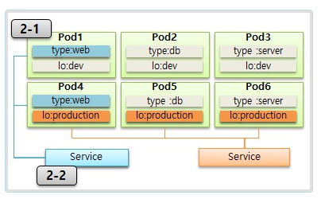
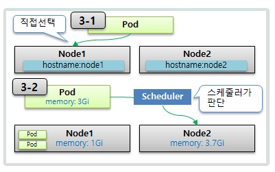

# Pod

> Container, Label, NodeSchedule




## 1. Container 


- Pod IP는 Pod가 생성될 때 부여되고, Pod 삭제 후 재생성시 IP가 변경됨

- Pod IP는 Cluster 내에서만 연결 가능하고, Cluster 외부에서는 통신 불가 

  (통신이 가능하게 하려면 Service를 연결하고, Service를 통해 가능 -> 다음장에서 학습 예정)

- Pod 내부에 여러개의 Container를 추가할 수 있고, 이 Container가 하나의 App으로써의 기능을 함

- Pod 내부의 Container끼리는 localhost로 Port만 지정해서 호출 가능

- Container 간에 같은 Port를 노출시키면 Pod 생성시 충돌 에러 발생

> 필독! Pod 생성시 확인 사항

Kubernetes Dashboard 상단 콤보박스에서 꼭 Namespace를 [default]로 해서 작업해주세요. 만약 [모든 네임스페이스]로 되어 있다면 Pod 생성시 [Deploying file has failed] 에러가 발생합니다.

  ### 1-1) Pod

```yaml
apiVersion: v1
kind: Pod
metadata:
  name: pod-1
spec:
  containers:
  - name: container1
    image: academyitwill/p8000
    imagePullPolicy: Always
    ports:
    - containerPort: 8000
  - name: container2
    image: academyitwill/p8080
    imagePullPolicy: Always
    ports:
    - containerPort: 8080
```
- pod id 확인(20.96.36.114)
- master node에접속해서 요청

```bash
[root@k8s-master ~]# curl  20.96.36.114:8000
pod-1[20.96.36.114] containerPort : 8000
[root@k8s-master ~]# curl  20.96.36.114:8080
pod-1[20.96.36.114] containerPort : 8080
[root@k8s-master ~]# 

```
- pod-1의 container1 접속해서 container2에 요청

```bash
  bash-4.4# curl 20.96.36.114:8000
  pod-1[20.96.36.114] containerPort : 8000
  bash-4.4# curl 20.96.36.114:8080
  pod-1[20.96.36.114] containerPort : 8080
  bash-4.4# 
```


```yaml
apiVersion: v1
kind: Pod
metadata:
  name: pod-2
spec:
  containers:
  - name: container1
    image: academyitwill/p8000
    ports:
    - containerPort: 8000
  - name: container2
    image: academyitwill/p8000
    ports:
    - containerPort: 8080
```

- 한 pod내에서 같은포트사용불가능
- pod IP는 재생성시 변경된다.


  ### 1-2) ReplicationController

```yaml
apiVersion: v1
kind: ReplicationController
metadata:
  name: replication-1
spec:
  replicas: 1
  selector:
    app: rc
  template:
    metadata:
      name: pod-1
      labels:
        app: rc
    spec:
      containers:
      - name: container
        image: academyitwill/init
 ```

 - pod IP확인후 pod삭제하면 다시pod생성된후 IP는 변경됨 

 ## 2. Label

 

 ### 2-1) Pod

```bash

apiVersion: v1
kind: Pod
metadata:
  name: pod-1
  labels:
    type: web
    lo: dev
spec:
  containers:
  - name: container
    image: academyitwill/init

---

apiVersion: v1
kind: Pod
metadata:
  name: pod-2
  labels:
    type: db
    lo: dev
spec:
  containers:
  - name: container
    image: academyitwill/init

---    

apiVersion: v1
kind: Pod
metadata:
  name: pod-3
  labels:
    type: server
    lo: dev
spec:
  containers:
  - name: container
    image: academyitwill/init
---    

apiVersion: v1
kind: Pod
metadata:
  name: pod-4
  labels:
    type: web
    lo: production
spec:
  containers:
  - name: container
    image: academyitwill/init

---    

apiVersion: v1
kind: Pod
metadata:
  name: pod-5
  labels:
    type: db
    lo: production
spec:
  containers:
  - name: container
    image: academyitwill/init    

--- 

apiVersion: v1
kind: Pod
metadata:
  name: pod-6
  labels:
    type: server
    lo: production
spec:
  containers:
  - name: container
    image: academyitwill/init   

```

  ### 2-2) Service

- selector에 type:web [labels에 type이 web 태그를 가진 pod 선택(pod-1,pod-2)]

```bash
apiVersion: v1
kind: Service
metadata:
  name: svc-for-web
spec:
  selector:
    type: web
  ports:
  - port: 8080

```

- selector에 lo:production [labels에 lo가 production 태그를 가진 pod 선택(pod-4,pod-5,prod-6)]

```bash
apiVersion: v1
kind: Service
metadata:
  name: svc-for-production
spec:
  selector:
    lo: production
  ports:
  - port: 8080

```


## 3. Node Schedule



  ### 3-1) Pod

```yaml
apiVersion: v1
kind: Pod
metadata:
  name: pod-3
spec:
  nodeSelector:
    kubernetes.io/hostname: k8s-node1
  containers:
  - name: container
    image: academyitwill/init
```
    
  ### 3-2) Pod

  ```yaml
  apiVersion: v1
  kind: Pod
  metadata:
    name: pod-4
  spec:
    containers:
    - name: container
      image: academyitwill/init
      resources:
        requests:
          memory: 2Gi
        limits:
          memory: 3Gi
  ```


  ## Sample Yaml

  ### Pod

```yaml
apiVersion: v1
kind: Pod
metadata:
  name: pod-4                           # Pod 이름
  labels:                               # Label 
    type: web                           
    lo: dev  
spec:
  nodeSelector:                         # Node 직접 지정시
    kubernetes.io/hostname: k8s-node1   
  containers:
  - name: container                     # Container 이름
    image: kubetm/init                  # 이미지 선택
    ports:
    - containerPort: 8080               
    resources:                          # 자원 사용량 설정
      requests:
        memory: 1Gi
      limits:
        memory: 1Gi
  ```

   ### kubectl

   #### **Create**

   ```bash
   # 파일이 있을 경우
    kubectl create -f ./pod.yaml

    # 내용과 함께 바로 작성
    kubectl create -f - <<END
    apiVersion: v1
    kind: Pod
    metadata:
      name: pod1
    spec:
      containers:
      - name: container
        image: kubetm/init
    END
   ```

   #### **Apply**
   ```bash
   kubectl apply -f ./pod.yaml
   ```  

   #### **Get**
  ```bash
  # 기본 Pod 리스트 조회 (Namepsace 포함)
  kubectl get pods -n defalut

  # 좀더 많은 내용 출력
  kubectl get pods -o wide

  # Pod 이름 지정
  kubectl get pod pod1

  # Json 형태로 출력
  kubectl get pod pod1 -o json
  ```
   #### **Describe**
  ```bash
  kubectl describe pod pod1
  ```
   #### **Delete**
   ```bash
   # 파일이 있을 경우 생성한 방법 그대로 삭제
    kubectl delete -f ./pod.yaml

    # 내용과 함께 바로 작성한 경우 생성한 방법 그대로 삭제
    kubectl delete -f - <<END
    apiVersion: v1
    kind: Pod
    metadata:
      name: pod1
    spec:
      containers:
      - name: container
        image: kubetm/init
    END

    # Pod 이름 지정
    kubectl delete pod pod1
   ```
   #### **Exec**

   ```bash
   # Pod이름이 pod1인 Container로 들어가기 (나올땐 exit)
    kubectl exec pod1 -it /bin/bash

    # Container가 두개 이상 있을때 Container이름이 con1인 Container로 들어가기 
    kubectl exec pod1 -c con1 -it /bin/bash
   ```

