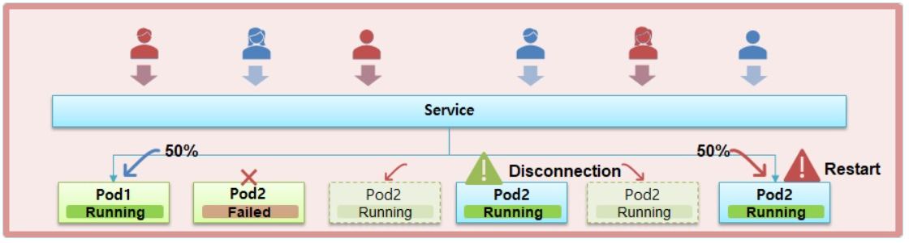
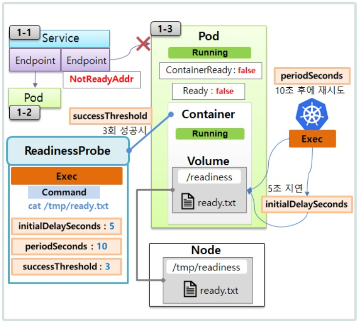
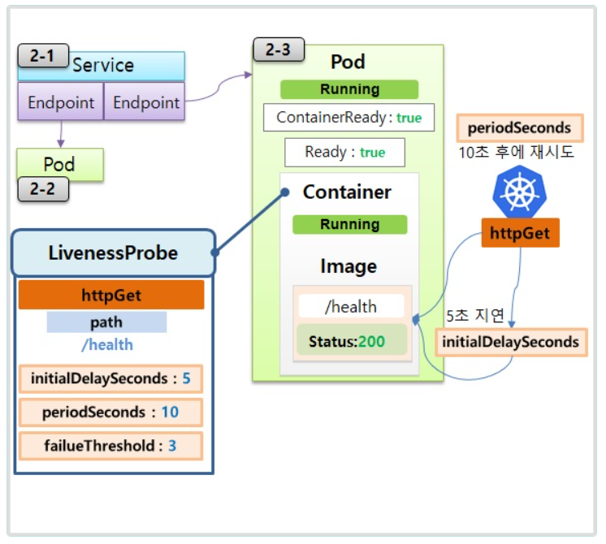

# Pod


> Readinessprobe, Livenessprobe

> Pod의 여러 특성과 기능들을 학습합니다.



## 1. ReadinessProbe 



    
  ### 1-1) Service

```yaml
apiVersion: v1
kind: Service
metadata:
  name: svc-readiness
spec:
  selector:
    app: readiness
  ports:
  - port: 8080
    targetPort: 8080
```


  ### 1-2) Pod

```yaml
apiVersion: v1
kind: Pod
metadata:
  name: pod1
  labels:
    app: readiness  
spec:
  containers:
  - name: container
    image: itwillacademy/app
    imagePullPolicy: Always
    ports:
    - containerPort: 8080	
  terminationGracePeriodSeconds: 0
```

```bash
[root@k8s-master ~]# while true; do date && curl 10.97.160.207:8080/hostname; sleep 1; done
Tue Dec 17 16:23:27 KST 2024
Hostname : pod1
Tue Dec 17 16:23:28 KST 2024
Hostname : pod1
Tue Dec 17 16:23:29 KST 2024
Hostname : pod1
..
```

 ### 1-3) Pod

```yml
apiVersion: v1
kind: Pod
metadata:
  name: pod-readiness-exec1
  labels:
    app: readiness  
spec:
  containers:
  - name: readiness
    image: itwillacademy/app 
    ports:
    - containerPort: 8080	
    readinessProbe:
      exec:
        command: ["cat", "/readiness/ready.txt"]
      initialDelaySeconds: 5
      periodSeconds: 10
      successThreshold: 3
    volumeMounts:
    - name: host-path
      mountPath: /readiness
  volumes:
  - name : host-path
    hostPath:
      path: /tmp/readiness
      type: DirectoryOrCreate
  terminationGracePeriodSeconds: 0
```

```bash
[root@k8s-master ~]# kubectl get events -w | grep pod-readiness-exec1
2m45s       Normal    Scheduled                pod/pod-readiness-exec1              Successfully assigned default/pod-readiness-exec1 to k8s-node2
2m44s       Normal    Pulling                  pod/pod-readiness-exec1              Pulling image "kubetm/app"
2m43s       Normal    Pulled                   pod/pod-readiness-exec1              Successfully pulled image "kubetm/app" in 1.369247258s (1.369251622s including waiting)
2m43s       Normal    Created                  pod/pod-readiness-exec1              Created container readiness
2m43s       Normal    Started                  pod/pod-readiness-exec1              Started container readiness
5s          Warning   Unhealthy                pod/pod-readiness-exec1              Readiness probe failed: cat: /readiness/ready.txt: No such file or directory
0s          Warning   Unhealthy                pod/pod-readiness-exec1              Readiness probe failed: cat: /readiness/ready.txt: No such file or directory
0s          Warning   Unhealthy                pod/pod-readiness-exec1              Readiness probe failed: cat: /readiness/ready.txt: No such file or directory
.
.

[root@k8s-master ~]# kubectl describe pod pod-readiness-exec1 | grep -A5 Conditions
Conditions:
  Type              Status
  Initialized       True 
  Ready             False 
  ContainersReady   False 
  PodScheduled      True 

[root@k8s-master ~]# kubectl describe endpoints svc-readiness
Name:         svc-readiness
Namespace:    default
Labels:       <none>
Annotations:  endpoints.kubernetes.io/last-change-trigger-time: 2024-12-17T07:26:34Z
Subsets:
  Addresses:          20.96.36.67
  NotReadyAddresses:  20.96.169.136
  Ports:
    Name     Port  Protocol
    ----     ----  --------
    <unset>  8080  TCP

Events:  <none>

```

```bash
[root@k8s-node2 ~]# cd /tmp/readiness
[root@k8s-node2 readiness]# touch ready.txt
[root@k8s-node2 readiness]# ls
ready.txt
```

- pod-readiness-exec1(Pod)에도 traffic이 생성
```bash
[root@k8s-master ~]# while true; do date && curl 10.97.160.207:8080/hostname; sleep 1; done
Hostname : pod1
Tue Dec 17 16:45:38 KST 2024
Hostname : pod-readiness-exec1
Tue Dec 17 16:45:39 KST 2024
Hostname : pod-readiness-exec1
.
```
- pod-readiness-exec1(Pod) 상태변경
```bash
[root@k8s-master ~]# kubectl describe endpoints svc-readiness
Name:         svc-readiness
Namespace:    default
Labels:       <none>
Annotations:  endpoints.kubernetes.io/last-change-trigger-time: 2024-12-17T07:39:24Z
Subsets:
  Addresses:          20.96.169.136,20.96.36.67
  NotReadyAddresses:  <none>
  Ports:
    Name     Port  Protocol
    ----     ----  --------
    <unset>  8080  TCP

Events:  <none>

```
- svc-readiness(Service) adddress할당

```bash
[root@k8s-master ~]# kubectl describe endpoints svc-readiness
Name:         svc-readiness
Namespace:    default
Labels:       <none>
Annotations:  endpoints.kubernetes.io/last-change-trigger-time: 2024-12-17T07:39:24Z
Subsets:
  Addresses:          20.96.169.136,20.96.36.67
  NotReadyAddresses:  <none>
  Ports:
    Name     Port  Protocol
    ----     ----  --------
    <unset>  8080  TCP

Events:  <none>

```


## 2. LivenessProbe



  ### 2-1) Service

```yaml
apiVersion: v1
kind: Service
metadata:
  name: svc-liveness
spec:
  selector:
    app: liveness
  ports:
  - port: 8080
    targetPort: 8080
```
    
  ### 2-2) Pod

```yaml
apiVersion: v1
kind: Pod
metadata:
  name: pod2
  labels:
    app: liveness
spec:
  containers:
  - name: container
    image: itwillacademy/app
    ports:
    - containerPort: 8080
  terminationGracePeriodSeconds: 0
```

 
   ### 2-3) Pod

```yml
apiVersion: v1
kind: Pod
metadata:
  name: pod-liveness-httpget1
  labels:
    app: liveness
spec:
  containers:
  - name: liveness
    image: itwillacademy/app
    ports:
    - containerPort: 8080
    livenessProbe:
      httpGet:
        path: /health
        port: 8080
      initialDelaySeconds: 5
      periodSeconds: 10
      failureThreshold: 3
  terminationGracePeriodSeconds: 0
```
- svc-liveness(Service)에소속된 pod2(Pod)와 pod-liveness-httpget1(Pod) 의 컨테이너가번갈아 실행


```bash
[root@k8s-master ~]# while true; do date && curl 10.98.38.36:8080/health; sleep 1; done
Tue Dec 17 17:31:11 KST 2024
pod2 is Running
Tue Dec 17 17:31:12 KST 2024
pod2 is Running
Tue Dec 17 17:31:13 KST 2024
pod-liveness-httpget1 is Running
Tue Dec 17 17:31:14 KST 2024
pod-liveness-httpget1 is Running
Tue Dec 17 17:31:15 KST 2024
```

```bash
[root@k8s-master ~]# watch "kubectl describe pod pod-liveness-httpget1 | grep -A10 Events"


```
```bash
[root@k8s-master ~]# curl 20.96.169.131:8080/status500
Status Code has Changed to 500
```
- pod-liveness-httpget1(Pod)  의 IP를 알아낸후 curl 20.96.169.131:8080/status500 를 실행
- livenessProbe에설정된 /health 요청시 500응답이 3번오면 Pod를 다시생성한다.
 


  ## Sample Yaml
   ### Pod
```yml   
apiVersion: v1
kind: Pod
metadata:
  name: pod-probe
  labels:
    app: probe
spec:
  containers:
  - name: probe
    image: kubetm/app
    ports:
    - containerPort: 8080	
    readinessProbe:
      exec:                   # command 내용으로 점검
        command: ["cat", "/readiness/ready.txt"]   
      initialDelaySeconds: 10
      periodSeconds: 5
      successThreshold: 3     # 3번 성공시 Service와 연결됨
    livenessProbe:
      httpGet:                # HttpGet 메소드로 점검
        path: /health         # 체크할 경로
        port: 8080            # 체크할 Port
      initialDelaySeconds: 5  # 최초 5초 후에 LivenessProbe 체크를 시작함
      periodSeconds: 10       # 10초마다 LivenessProbe 체크
      failureThreshold: 3      # 3번 실패시 Pod Restart
```

  ## kubectl
   ### Watch

```bash   
# Object들의 모든 Event 정보를 지속적으로 조회해서 | 그중에 pod-readiness-exec1라는 단어와 매칭되는 내용만 출력
kubectl get events -w | grep pod-readiness-exec1
# pod-readiness-exec1이름의 Pod 상세 내용중에 | Events와 매칭되는 단어에서 20번째 줄까지 지속적으로 출력
watch "kubectl describe pod pod-readiness-exec1 | grep -A20 Events"
```


  ## Tips
   ### **HTTP Status**

   - 200 ~ 400까지는 성공 그외의 상태코드는 실패
