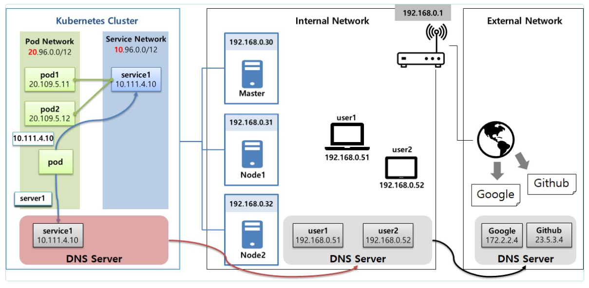
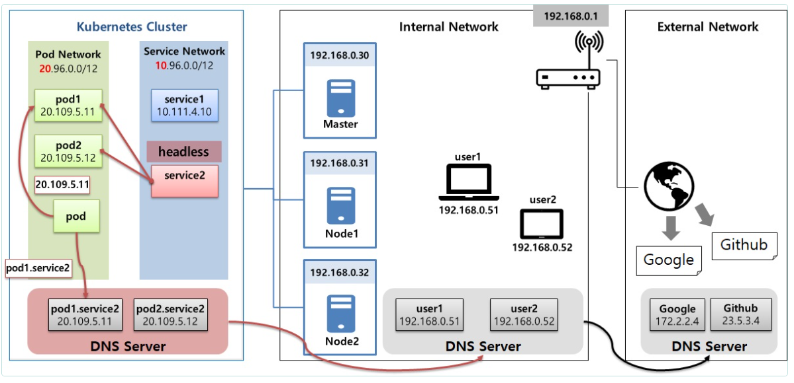
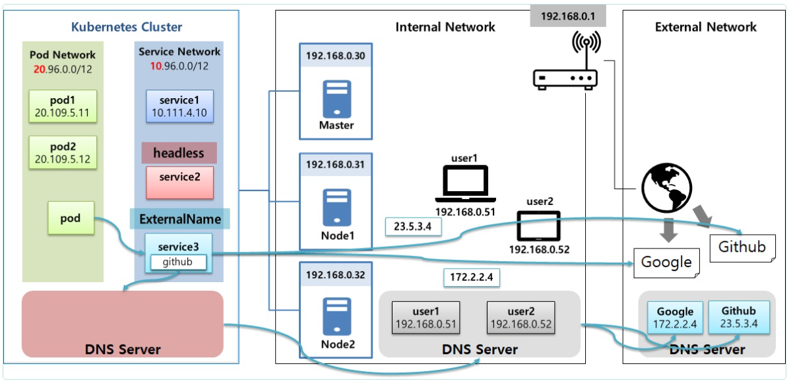

# Service

> **Headless, Endpoint, ExternalName**


  ## Dns 

  

  ## Headless

  

  ## External

  

  ## Headless

  

  ### 1-1) Service

```yml
apiVersion: v1
kind: Service
metadata:
  name: clusterip1
spec:
  selector:
    svc: clusterip
  ports:
  - port: 80
    targetPort: 8080
```

  ### 1-2) Pod 

```yml
apiVersion: v1
kind: Pod
metadata:
  name: pod1
  labels:
    svc: clusterip
spec:
  containers:
  - name: container
    image: itwillacademy/app
```

  ### 1-3) Request Pod

```yml
apiVersion: v1
kind: Pod
metadata:
  name: request-pod
spec:
  containers:
  - name: container
    image: itwillacademy/init
```
```bash
[root@k8s-master ~]# kubectl exec request-pod -it /bin/bash

```
nslookup

```bash
[root@request-pod /]# nslookup clusterip1

Server:		10.96.0.10
Address:	10.96.0.10#53

Name:	clusterip1.default.svc.cluster.local
Address: 10.96.14.103

[root@request-pod /]# nslookup clusterip1.default.svc.cluster.local
Server:		10.96.0.10
Address:	10.96.0.10#53

Name:	clusterip1.default.svc.cluster.local
Address: 10.96.14.103

```

curl

```bash
[root@request-pod /]# curl clusterip1/hostname
Hostname : pod1
[root@request-pod /]# curl clusterip1.default.svc.cluster.local/hostname
Hostname : pod1

```


  ### 2-1) Service

```yml
apiVersion: v1
kind: Service
metadata:
  name: headless1
spec:
  selector:
    svc: headless
  ports:
    - port: 80
      targetPort: 8080    
  clusterIP: None
```

  ### 2-2) Pod

```yml
apiVersion: v1
kind: Pod
metadata:
  name: pod4
  labels:
    svc: headless
spec:
  hostname: pod-a
  subdomain: headless1
  containers:
  - name: container
    image: itwillacademy/app
```

```yml
apiVersion: v1
kind: Pod
metadata:
  name: pod5
  labels:
    svc: headless
spec:
  hostname: pod-b
  subdomain: headless1
  containers:
  - name: container
    image: itwillacademy/app
```

Nslookup

```bash
[root@request-pod /]# nslookup headless1
Server:		10.96.0.10
Address:	10.96.0.10#53

Name:	headless1.default.svc.cluster.local
Address: 20.96.36.72
Name:	headless1.default.svc.cluster.local
Address: 20.96.169.135

[root@request-pod /]# nslookup pod-a.headless1
Server:		10.96.0.10
Address:	10.96.0.10#53

Name:	pod-a.headless1.default.svc.cluster.local
Address: 20.96.36.72

[root@request-pod /]# nslookup pod-a.headless1
Server:		10.96.0.10
Address:	10.96.0.10#53

Name:	pod-a.headless1.default.svc.cluster.local
Address: 20.96.36.72

```

curl

```bash
[root@request-pod /]# curl pod-a.headless1:8080/hostname
Hostname : pod-a

[root@request-pod /]# curl pod-b.headless1:8080/hostname
Hostname : pod-b
```

  ## Endpoint

  

   ### 3-1) Service

```yml
apiVersion: v1
kind: Service
metadata:
  name: endpoint1
spec:
  selector:
    svc: endpoint
  ports:
  - port: 8080
```

   ### 3-2) Pod 

```yml
apiVersion: v1
kind: Pod
metadata:
  name: pod7
  labels:
    svc: endpoint
spec:
  containers:
  - name: container
    image: itwillacademy/app
```
```bash
[root@k8s-master ~]# kubectl describe endpoints endpoint1
Name:         endpoint1
Namespace:    default
Labels:       <none>
Annotations:  endpoints.kubernetes.io/last-change-trigger-time: 2024-12-17T11:04:50Z
Subsets:
  Addresses:          20.96.36.80
  NotReadyAddresses:  <none>
  Ports:
    Name     Port  Protocol
    ----     ----  --------
    <unset>  8080  TCP

Events:  <none>

```


   ### 4-1) Service   

```yml
apiVersion: v1
kind: Service
metadata:
  name: endpoint2
spec:
  ports:
  - port: 8080
```
  ### 4-2) Pod

```yml
apiVersion: v1
kind: Pod
metadata:
  name: pod9
spec:
  containers:
  - name: container
    image: itwillacademy/app
```
   ### 4-3) Endpoint

```yml
apiVersion: v1
kind: Endpoints
metadata:
  name: endpoint2
subsets:
 - addresses:
   - ip: 20.109.5.12
   ports:
   - port: 8080
```
```bash
[root@k8s-master ~]# kubectl exec request-pod -it /bin/bash
[root@request-pod /]# curl endpoint2:8080/hostname
Hostname : pod9

```


   ### 5-1) Service
```yml
apiVersion: v1
kind: Service
metadata:
  name: endpoint3
spec:
  ports:
  - port: 80
```

Github - Ip Address

```bash
[root@request-pod /]# nslookup https://www.github.com
Server:		10.96.0.10
Address:	10.96.0.10#53

Non-authoritative answer:
https://www.github.com	canonical name = github.github.io.
Name:	github.github.io
Address: 185.199.110.153
Name:	github.github.io
Address: 185.199.111.153
Name:	github.github.io
Address: 185.199.109.153
Name:	github.github.io
Address: 185.199.108.153
Name:	github.github.io
Address: 2606:50c0:8002::153
Name:	github.github.io
Address: 2606:50c0:8000::153
Name:	github.github.io
Address: 2606:50c0:8001::153
Name:	github.github.io
Address: 2606:50c0:8003::153

https://github.com/
[root@request-pod /]# curl -O 185.199.110.153:80/2024-07-JAVA-DEVELOPER-155/deploy_k8s/blob/master/Service-Headless_ExternalName.pdf
[root@request-pod /]# ls
Service-Headless_ExternalName.pdf  bin   dev  home  lib64  mnt  proc  run   srv  tmp  var

```
   ### 5-2) 
   
```yml
apiVersion: v1
kind: Endpoints
metadata:
  name: endpoint3
subsets:
 - addresses:
   - ip: 185.199.110.153
   ports:
   - port: 80
```   

```bash
[root@request-pod /]# curl -O endpoint3/2024-07-JAVA-DEVELOPER-155/deploy_k8s/blob/master/Service-Headless_ExternalName.pdf
```

  ## ExternalName 

  

   ### 6-1) Service
```yml
apiVersion: v1
kind: Service
metadata:
 name: externalname1
spec:
 type: ExternalName
 externalName: github.github.io
```
```bash
curl -O externalname1/kubetm/kubetm.github.io/blob/master/documents/intermediate/Service-Headless_ExternalName.pdf
```

  ## yaml
   ### **Service**

```yml
apiVersion: v1
kind: Service
metadata:
  name: headless1
spec:
  selector:             # 생략시 Endpoints 직접 생성해서 사용
    svc: headless
  ports:
    - port: 80
      targetPort: 8080    
  clusterIP: None       # headless 서비스  
  type: ExternalName    # ExternalName Service 설정시 사용
  externalName: github.github.io  # ExternalName사용시 연결 Domain지정
```
   ### **Endpoints**

```yml
apiVersion: v1
kind: Endpoints
metadata:
  name: headless1       # Service의 이름과 동일하게 지정
subsets:
 - addresses:
   - ip: 20.109.5.12    # Pod의 ClusterIp
   ports:
   - port: 8080         # Pod의 Container Port
```
   ### **Pod**

```yml
apiVersion: v1
kind: Pod
metadata:
  name: pod4
  labels:
    svc: headless
spec:
  hostname: pod-a       # 호스트네임 설정, 생략시 Pod Name이 적용됨
  subdomain: headless1  # headless 서비스 사용시 Service의 이름으로 지정
  containers:
  - name: container
    image: kubetm/app
```
## kubectl

### **Exec**

```bash
# Pod이름이 request-pod인 Container로 들어가기 (나올땐 exit)
kubectl exec request-pod -it /bin/bash
```

### **Describe**
```bash
# Endpoints 상세보기
kubectl describe endpoints endpoint1
```

## Tips

### **Dns**

- Kubernetes 버전 1.11 이전의 Kubernetes DNS 서비스는 kube-dns를 기반
- 버전 1.11은 kube-dns의 일부 보안 및 안정성 문제를 해결하기 위해 CoreDNS 를 도입


 