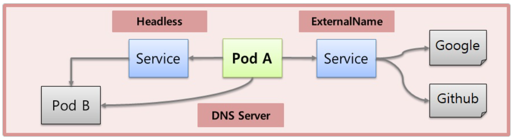
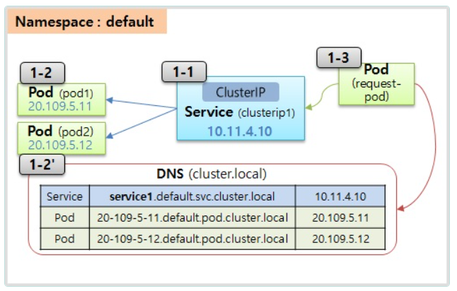
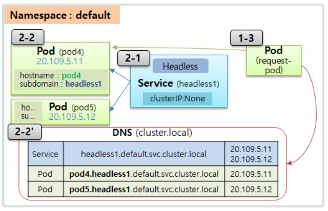
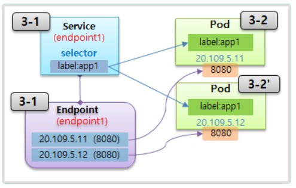
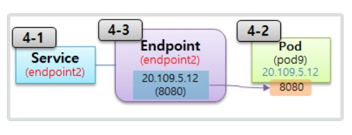
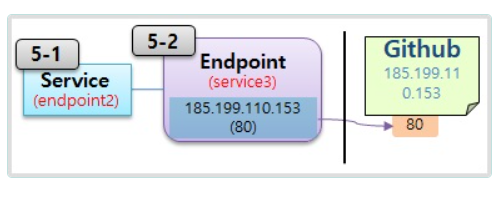
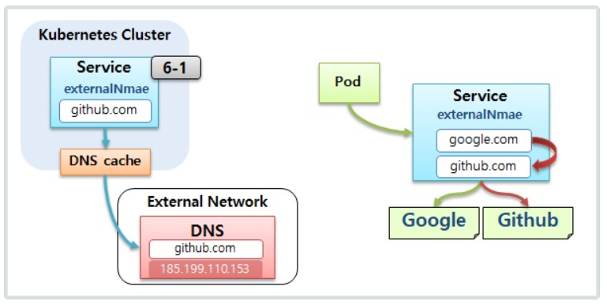

# Service - Headless, Endpoint, ExternalName




 
  ## 1. ClusterIP

  

  - Service의 이름이 도메인으로 자동 등록되기 때문에, Pod에서는 Service의 이름으로 호출 가능
  - 또한 쿠버네티스에 설치된 CoreDNS를 통해 Service의 이름으로 Serivce IP를 확인 가능
  - Service FQDN : <service-name>.<namespace-name>.svc.cluster.local <br>
     (같은 namespace 상에서는 <service-name>만, 타 namespace를 호출시 <service-name>.<namespace-name>까지 입력 필요)
  - Pod FQDN : <pod-ip>.<namespace-name>.pod.cluster.local  (실 사용 불가)

  ### 1-1) Service

```yml
apiVersion: v1
kind: Service
metadata:
  name: clusterip1
spec:
  selector:
    svc: clusterip
  ports:
  - port: 80
    targetPort: 8080
```

  ### 1-2) Pod 

```yml
apiVersion: v1
kind: Pod
metadata:
  name: pod1
  labels:
    svc: clusterip
spec:
  containers:
  - name: container
    image: itwillacademy/app
  
```

  ### 1-3) Request Pod

```yml
apiVersion: v1
kind: Pod
metadata:
  name: request-pod
spec:
  containers:
  - name: container
    image: itwillacademy/init

```

▶ Master에서 kubectl을 이용해 Pod(request-pod) 내부로 접근

```bash
[root@k8s-master ~]# kubectl exec request-pod -it /bin/bash

```

▶ nslookup를 통해 DNS 질의

```bash
[root@request-pod /]# nslookup clusterip1

Server:		10.96.0.10
Address:	10.96.0.10#53

Name:	clusterip1.default.svc.cluster.local
Address: 10.96.14.103

[root@request-pod /]# nslookup clusterip1.default.svc.cluster.local
Server:		10.96.0.10
Address:	10.96.0.10#53

Name:	clusterip1.default.svc.cluster.local
Address: 10.96.14.103

```

▶ Domain 이름을 이용해서 Pod 호출

```bash
[root@request-pod /]# curl clusterip1/hostname
Hostname : pod1
[root@request-pod /]# curl clusterip1.default.svc.cluster.local/hostname
Hostname : pod1

```


## 2. Headless Service
<hr>



- Headless Service를 만들면 Service의 IP는 할당되지 않음
- 그래서 DNS에 Service 호출 시 Service IP는 없고, 해당 Service에 연결된 Pod의 IP들을 반환함
- 또한 Headless Service를 통해 Pod를 Domain 이름으로 호출 가능
- Pod FQDN : <pod-name>.<service-name>.<namespace-name>.svc.cluster.local  

  ### 2-1) Service

```yml
apiVersion: v1
kind: Service
metadata:
  name: headless1
spec:
  selector:
    svc: headless
  ports:
    - port: 80
      targetPort: 8080    
  clusterIP: None
```

  ### 2-2) Pod

```yml
apiVersion: v1
kind: Pod
metadata:
  name: pod4
  labels:
    svc: headless
spec:
  hostname: pod-a
  subdomain: headless1
  containers:
  - name: container
    image: itwillacademy/app
```

```yml
apiVersion: v1
kind: Pod
metadata:
  name: pod5
  labels:
    svc: headless
spec:
  hostname: pod-b
  subdomain: headless1
  containers:
  - name: container
    image: itwillacademy/app
```

▶ Pod(request-pod)에서 nslookup를 통해 DNS 질의

```bash
[root@request-pod /]# nslookup headless1
Server:		10.96.0.10
Address:	10.96.0.10#53

Name:	headless1.default.svc.cluster.local
Address: 20.96.36.72
Name:	headless1.default.svc.cluster.local
Address: 20.96.169.135

[root@request-pod /]# nslookup pod-a.headless1
Server:		10.96.0.10
Address:	10.96.0.10#53

Name:	pod-a.headless1.default.svc.cluster.local
Address: 20.96.36.72

[root@request-pod /]# nslookup pod-b.headless1
Server:		10.96.0.10
Address:	10.96.0.10#53

Name:	pod-b.headless1.default.svc.cluster.local
Address: 20.96.36.72

```

▶ Pod(request-pod)에서 Pod FQDN을 이용해서 Pod 호출

```bash
[root@request-pod /]# curl pod-a.headless1:8080/hostname
Hostname : pod-a

[root@request-pod /]# curl pod-b.headless1:8080/hostname
Hostname : pod-b
```

## 3.Endpoint

  

- Service 생성시 Service의 이름과 동일한 이름으로 EndPoint를 만들어줌
- Endpoint에는 Service에 연결된 Pod의 IP:Port 정보가 관리됨

   ### 3-1) Service

```yml
apiVersion: v1
kind: Service
metadata:
  name: endpoint1
spec:
  selector:
    svc: endpoint
  ports:
  - port: 8080
```

   ### 3-2) Pod 

```yml
apiVersion: v1
kind: Pod
metadata:
  name: pod7
  labels:
    svc: endpoint
spec:
  containers:
  - name: container
    image: itwillacademy/app
```
▶ Master에서 endpoint 조회

```bash
[root@k8s-master ~]# kubectl describe endpoints endpoint1
Name:         endpoint1
Namespace:    default
Labels:       <none>
Annotations:  endpoints.kubernetes.io/last-change-trigger-time: 2024-12-17T11:04:50Z
Subsets:
  Addresses:          20.96.36.80
  NotReadyAddresses:  <none>
  Ports:
    Name     Port  Protocol
    ----     ----  --------
    <unset>  8080  TCP

Events:  <none>

```
## 4. Endpoint - 2/3



- Endpoint를 사용자가 직접 만들 수 있음. 이 경우 Pod의 IP:Port 정보도 수동 입력 필요


   ### 4-1) Service   

```yml
apiVersion: v1
kind: Service
metadata:
  name: endpoint2
spec:
  ports:
  - port: 8080
```
  ### 4-2) Pod

```yml
apiVersion: v1
kind: Pod
metadata:
  name: pod9
spec:
  containers:
  - name: container
    image: itwillacademy/app
```
   ### 4-3) Endpoint

```yml
apiVersion: v1
kind: Endpoints
metadata:
  name: endpoint2
subsets:
 - addresses:
   - ip: <pod-ip>
   ports:
   - port: 8080
```

▶ Pod(request-pod)에서 Service(endpoint2)로 연결된 Pod 호출

```bash
[root@k8s-master ~]# kubectl exec request-pod -it /bin/bash
[root@request-pod /]# curl endpoint2:8080/hostname
Hostname : pod9

```
## 5. Endpoint - 3/3



- Endpoint를 사용자가 직접 만들 때 외부 연결 IP를 설정할 수 있음

   ### 5-1) Service
```yml
apiVersion: v1
kind: Service
metadata:
  name: endpoint3
spec:
  ports:
  - port: 443
```
▶ Github를 IP로 호출 

 * GitHub 보안강화로 Host를 Header 넣어야 다운로드가 가능해졌습니다.

```bash
[root@request-pod /]# nslookup raw.githubusercontent.com
Server:         10.96.0.10
Address:        10.96.0.10#53

Non-authoritative answer:
Name:   raw.githubusercontent.com
Address: 185.199.109.133
Name:   raw.githubusercontent.com
Address: 185.199.111.133
Name:   raw.githubusercontent.com
Address: 185.199.108.133
Name:   raw.githubusercontent.com
Address: 185.199.110.133
Name:   raw.githubusercontent.com
Address: 2606:50c0:8002::154
Name:   raw.githubusercontent.com
Address: 2606:50c0:8001::154
Name:   raw.githubusercontent.com
Address: 2606:50c0:8003::154
Name:   raw.githubusercontent.com
Address: 2606:50c0:8000::154


[root@request-pod /]# curl -k -O https://185.199.110.133/2025-01-JAVA-DEVELOPER-159/deploy_k8s/raw/refs/heads/master/app.jar -H "Host: raw.githubusercontent.com"
[root@request-pod /]# ls
anaconda-post.log  app.jar  app.js  bin  boot  dev  etc  home  lib  lib64  media  mnt  opt  proc  root  run  sbin  srv  sys  tmp  usr  var

```
   ### 5-2) 
   
```yml
apiVersion: v1
kind: Endpoints
metadata:
  name: endpoint3
subsets:
 - addresses:
   - ip: 185.199.110.153
   ports:
   - port: 80
```   

```bash
[root@request-pod /]# curl -O endpoint3/2024-07-JAVA-DEVELOPER-155/deploy_k8s/blob/master/Service-Headless_ExternalName.pdf
```

  ## ExternalName 

  

   ### 6-1) Service
```yml
apiVersion: v1
kind: Service
metadata:
 name: externalname1
spec:
 type: ExternalName
 externalName: github.github.io
```
```bash
[root@request-pod /]# curl -O externalname1/2024-07-JAVA-DEVELOPER-155/deploy_k8s/blob/master/Service-Headless_ExternalName.pdf
```

  ## yaml
   ### **Service**

```yml
apiVersion: v1
kind: Service
metadata:
  name: headless1
spec:
  selector:             # 생략시 Endpoints 직접 생성해서 사용
    svc: headless
  ports:
    - port: 80
      targetPort: 8080    
  clusterIP: None       # headless 서비스  
  type: ExternalName    # ExternalName Service 설정시 사용
  externalName: github.github.io  # ExternalName사용시 연결 Domain지정
```
   ### **Endpoints**

```yml
apiVersion: v1
kind: Endpoints
metadata:
  name: headless1       # Service의 이름과 동일하게 지정
subsets:
 - addresses:
   - ip: 20.109.5.12    # Pod의 ClusterIp
   ports:
   - port: 8080         # Pod의 Container Port
```
   ### **Pod**

```yml
apiVersion: v1
kind: Pod
metadata:
  name: pod4
  labels:
    svc: headless
spec:
  hostname: pod-a       # 호스트네임 설정, 생략시 Pod Name이 적용됨
  subdomain: headless1  # headless 서비스 사용시 Service의 이름으로 지정
  containers:
  - name: container
    image: kubetm/app
```
## kubectl

### **Exec**

```bash
# Pod이름이 request-pod인 Container로 들어가기 (나올땐 exit)
kubectl exec request-pod -it /bin/bash
```

### **Describe**
```bash
# Endpoints 상세보기
kubectl describe endpoints endpoint1
```

## Tips

### **Dns**

- Kubernetes 버전 1.11 이전의 Kubernetes DNS 서비스는 kube-dns를 기반
- 버전 1.11은 kube-dns의 일부 보안 및 안정성 문제를 해결하기 위해 CoreDNS 를 도입


 