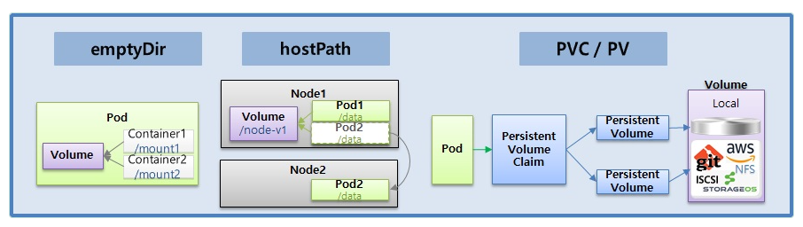
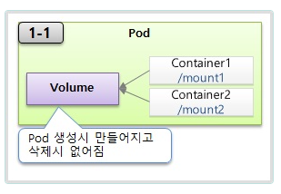
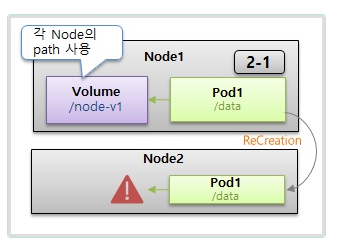
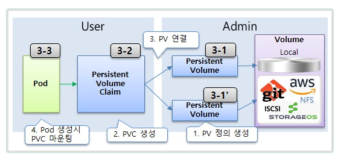

# Volume

> emptyDir, hostPath, PV/PVC




  ## 1. emptyDir

  


  ### 1-1) Pod

```yaml
apiVersion: v1
kind: Pod
metadata:
  name: pod-volume-1
spec:
  containers:
  - name: container1
    image: academyitwill/init
    volumeMounts:
    - name: empty-dir
      mountPath: /mount1
  - name: container2
    image: academyitwill/init
    volumeMounts:
    - name: empty-dir
      mountPath: /mount2
  volumes:
  - name : empty-dir
    emptyDir: {}
```
- pod-volume-1 (pod) 의 container1(container) 에 접속 
```bash
[root@pod-volume-1 /]# ls
anaconda-post.log  bin  boot  dev  etc  home  lib  lib64  media  mnt  mount1  opt  proc  root  run  sbin  srv  sys  tmp  usr  var
[root@pod-volume-1 /]# mount | grep mount1
/dev/sda4 on /mount1 type xfs (rw,relatime,seclabel,attr2,inode64,logbufs=8,logbsize=32k,noquota)
[root@pod-volume-1 /]# cd mount1
[root@pod-volume-1 mount1]# ls
[root@pod-volume-1 mount1]# echo "file content" >> file.txt
[root@pod-volume-1 mount1]# ls
filet.xt
[root@pod-volume-1 mount1]# 
```
- pod-volume-1 (pod) 의 container2(container) 에 접속 
```bash
[root@pod-volume-1 /]# ls
anaconda-post.log  bin  boot  dev  etc  home  lib  lib64  media  mnt  mount2  opt  proc  root  run  sbin  srv  sys  tmp  usr  var
[root@pod-volume-1 /]# cd mount2
[root@pod-volume-1 mount2]# ls
file.txt
[root@pod-volume-1 mount2]# cat file.txt
file content
[root@pod-volume-1 mount2]# 
```
- pod삭제후 다시생성시에는 삭제됨
  > pod-volume-1 삭제후  다시생성시키면 mount1에  file1.txt 존재안함


  ## 2. hostPath

   

   ### 2-1) Pod
```yml  
apiVersion: v1
kind: Pod
metadata:
  name: pod-volume-2
spec:
  nodeSelector:
    kubernetes.io/hostname: k8s-node1
  containers:
  - name: container
    image: academyitwill/init
    volumeMounts:
    - name: host-path
      mountPath: /mount1
  volumes:
  - name : host-path
    hostPath:
      path: /node-v
      type: DirectoryOrCreate  
```

```yml
apiVersion: v1
kind: Pod
metadata:
  name: pod-volume-3
spec:
  nodeSelector:
    kubernetes.io/hostname: k8s-node1
  containers:
  - name: container
    image: academyitwill/init
    volumeMounts:
    - name: host-path
      mountPath: /mount1
  volumes:
  - name : host-path
    hostPath:
      path: /node-v
      type: DirectoryOrCreate

```

- pod-volume-2,pod-volume-2는 k8s-node1에생성되고 k8s-node1의 node-v 디렉토리를공유

```bash
[root@pod-volume-2 /]# ls   
anaconda-post.log  bin  boot  dev  etc  home  lib  lib64  media  mnt  mount1  opt  proc  root  run  sbin  srv  sys  tmp  usr  var
[root@pod-volume-2 /]# cd mount1
[root@pod-volume-2 mount1]# ls
[root@pod-volume-2 mount1]# echo "file context" >> file.txt
[root@pod-volume-2 mount1]# ls
file.txt
```

```bash
[root@pod-volume-3 /]# ls
anaconda-post.log  bin  boot  dev  etc  home  lib  lib64  media  mnt  mount1  opt  proc  root  run  sbin  srv  sys  tmp  usr  var
[root@pod-volume-3 /]# cd mount1
[root@pod-volume-3 mount1]# ls
file.txt
[root@pod-volume-3 mount1]# cat file.txt
file context
```
  

## 3. PVC / PV



  ### 3-1) PersistentVolume

```yml
apiVersion: v1
kind: PersistentVolume
metadata:
  name: pv-03
spec:
  capacity:
    storage: 2G
  accessModes:
  - ReadWriteOnce
  local:
    path: /node-v
  nodeAffinity:
    required:
      nodeSelectorTerms:
      - matchExpressions:
        - {key: kubernetes.io/hostname, operator: In, values: [k8s-node1]}
```
  ## 3-2) PersistentVolumeClaim


```yml
apiVersion: v1
kind: PersistentVolumeClaim
metadata:
  name: pvc-01
spec:
  accessModes:
  - ReadWriteOnce
  resources:
    requests:
      storage: 1G
  storageClassName: ""
```  

  ## 3-3) Pod

```yml
apiVersion: v1
kind: Pod
metadata:
  name: pod-volume-3
spec:
  containers:
  - name: container
    image: academyitwill/init
    volumeMounts:
    - name: pvc-pv
      mountPath: /mount3
  volumes:
  - name : pvc-pv
    persistentVolumeClaim:
      claimName: pvc-01
```

> ## PV-PVC를 label과 selector를 이용해 연결하는 방법 예시

  ### PersistentVolume

```yml
  apiVersion: v1
kind: PersistentVolume
metadata:
  name: pv-04
  labels:
    pv: pv-04
spec:
  capacity:
    storage: 2G
  accessModes:
  - ReadWriteOnce
  local:
    path: /node-v
  nodeAffinity:
    required:
      nodeSelectorTerms:
      - matchExpressions:
        - {key: kubernetes.io/hostname, operator: In, values: [k8s-node1]}
```
  
  ### PersistentVolumeClaim

```yml
apiVersion: v1
kind: PersistentVolumeClaim
metadata:
  name: pvc-04
spec:
  accessModes:
  - ReadWriteOnce
  resources:
    requests:
      storage: 2G
  storageClassName: ""
  selector:
    matchLabels:
      pv: pv-04
```

## Tips

### **hostPath Type**

 - DirectoryOrCreate : 실제 경로가 없다면 생성
 - Directory : 실제 경로가 있어야됨
 - FileOrCreate : 실제 경로에 파일이 없다면 생성
 - File : 실제 파일이 었어야함
 


        
