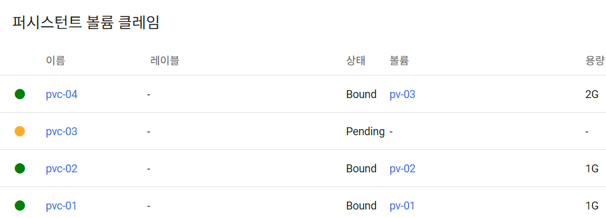

# Volume

> emptyDir, hostPath, PV/PVC


  ## 1. emptyDir

  

- Pod 내에서 Container간에 파일을 공유하기 위해 사용하는 Volume
- Pod가 삭제되면 Volume의 내용은 모두 없어지기 때문에 Pod가 삭제되도 상관이 없는 데이터를 담아야 함

  ### 1-1) Pod

```yaml
apiVersion: v1
kind: Pod
metadata:
  name: pod-volume-1
spec:
  containers:
  - name: container1
    image: academyitwill/init
    volumeMounts:
    - name: empty-dir
      mountPath: /mount1
  - name: container2
    image: academyitwill/init
    volumeMounts:
    - name: empty-dir
      mountPath: /mount2
  volumes:
  - name : empty-dir
    emptyDir: {}
```
▶ Pod(container1) 내부로 들어가서 Mount 상태 확인 및 파일 생성

```bash
[root@pod-volume-1 /]# ls
anaconda-post.log  bin  boot  dev  etc  home  lib  lib64  media  mnt  mount1  opt  proc  root  run  sbin  srv  sys  tmp  usr  var
[root@pod-volume-1 /]# mount | grep mount1
/dev/sda4 on /mount1 type xfs (rw,relatime,seclabel,attr2,inode64,logbufs=8,logbsize=32k,noquota)
[root@pod-volume-1 /]# cd mount1
[root@pod-volume-1 mount1]# ls
[root@pod-volume-1 mount1]# echo "file content" >> file.txt
[root@pod-volume-1 mount1]# ls
filet.xt
[root@pod-volume-1 mount1]#
```
▶ Pod(container2) 내부로 들어가서 파일 동기화 확인

```bash
[root@pod-volume-1 /]# ls
anaconda-post.log  bin  boot  dev  etc  home  lib  lib64  media  mnt  mount2  opt  proc  root  run  sbin  srv  sys  tmp  usr  var
[root@pod-volume-1 /]# cd mount2
[root@pod-volume-1 mount2]# ls
file.txt
[root@pod-volume-1 mount2]# cat file.txt
file content
[root@pod-volume-1 mount2]# 
```
- pod삭제후 다시생성시에는 삭제됨
  > pod-volume-1 삭제후  다시생성시키면 mount1에  file1.txt 존재안함


  ## 2. hostPath

   

- WorkerNode의 특정 Path를 Pod간의 공유 Volume으로 사용
- 테스트 용도로 임시적으로 저장할 Volume이 필요 할 때 사용
- HostPath 볼륨에는 보안 위험이 있기 때문에 운영환경에서는 가능하면 HostPath를 사용하지 않는 것을 권고
- type 옵션 : DirectoryOrCreate (실제 경로가 없다면 생성), Directory (실제 경로가 있어야됨), FileOrCreate (실제 경로에 파일이 없다면 생성), File (실제 파일이 었어야함)

   ### 2-1) Pod
```yml  
apiVersion: v1
kind: Pod
metadata:
  name: pod-volume-2
spec:
  nodeSelector:
    kubernetes.io/hostname: k8s-worker1
  containers:
  - name: container
    image: academyitwill/init
    volumeMounts:
    - name: host-path
      mountPath: /mount1
  volumes:
  - name : host-path
    hostPath:
      path: /node-v
      type: DirectoryOrCreate  
```

```yml
apiVersion: v1
kind: Pod
metadata:
  name: pod-volume-3
spec:
  nodeSelector:
    kubernetes.io/hostname: k8s-worker1
  containers:
  - name: container
    image: academyitwill/init
    volumeMounts:
    - name: host-path
      mountPath: /mount1
  volumes:
  - name : host-path
    hostPath:
      path: /node-v
      type: DirectoryOrCreate

```

- pod-volume-2,pod-volume-3는 k8s-worker1 에생성되고 k8s-worker1 의 node-v 디렉토리를공유

▶ Pod(pod-volume-2)에 들어가서 파일 생성

```bash
[root@pod-volume-2 /]# ls   
anaconda-post.log  bin  boot  dev  etc  home  lib  lib64  media  mnt  mount1  opt  proc  root  run  sbin  srv  sys  tmp  usr  var
[root@pod-volume-2 /]# cd mount1
[root@pod-volume-2 mount1]# ls
[root@pod-volume-2 mount1]# echo "file context" >> file.txt
[root@pod-volume-2 mount1]# ls
file.txt
```
▶ Pod(pod-volume-3)에 들어가서 동기화 확인

```bash
[root@pod-volume-3 /]# ls
anaconda-post.log  bin  boot  dev  etc  home  lib  lib64  media  mnt  mount1  opt  proc  root  run  sbin  srv  sys  tmp  usr  var
[root@pod-volume-3 /]# cd mount1
[root@pod-volume-3 mount1]# ls
file.txt
[root@pod-volume-3 mount1]# cat file.txt
file context
```
▶ Node(k8s-worker1)에 들어가서 동기화 확인

```bash  
[root@k8s-worker1 ~]# cd /
[root@k8s-worker1 /]# ls
bin  boot  dev  etc  home  lib  lib64  media  mnt  node-v  opt  proc  root  run  sbin  srv  swapfile  sys  tmp  usr  var
[root@k8s-worker1 /]# cd node-v
[root@k8s-worker1 node-v]# ls
file.txt
[root@k8s-worker1 node-v]# cat file.txt 
file context
[root@k8s-worker1 node-v]# 
```

- pod-volume-2,pod-volume-3삭제후 다시생성해도 데이타유지
  
```bash
[root@pod-volume-2 /]# ls
anaconda-post.log  bin  boot  dev  etc  home  lib  lib64  media  mnt  mount1  opt  proc  root  run  sbin  srv  sys  tmp  usr  var
[root@pod-volume-2 /]# cd mount1
[root@pod-volume-2 mount1]# ls
file.txt
```


```yml
apiVersion: v1
kind: Pod
metadata:
  name: pod-volume-4
spec:
  containers:
  - name: container
    image: academyitwill/init
    volumeMounts:
    - name: host-path
      mountPath: /mount1
  volumes:
  - name : host-path
    hostPath:
      path: /node-v
      type: DirectoryOrCreate
```
- 노드를 지정하지않고 pod-volume-4 생성하면
- 현재자원배분상 k8s-worker2에 만들어지므로 공유안됨

```bash
[root@pod-volume-4 /]# ls
anaconda-post.log  bin  boot  dev  etc  home  lib  lib64  media  mnt  mount1  opt  proc  root  run  sbin  srv  sys  tmp  usr  var
[root@pod-volume-4 /]# cd mount1
[root@pod-volume-4 mount1]# ls
[root@pod-volume-4 mount1]# 
```


## 3. PVC / PV


- Pod에 영구적인 Volume을 할당하기 위한 리소스로 Pod -> PVC -> PV(Volume) 순으로 연결
- Pod가 삭제됐다 재생성되어도, PVC/PV를 통해 지정된 Volume에 연결됨
- PVC와 PV는 capacity와 accessMode를 기준으로 연결됨 
  * 동일한 capacity와 accessMode가 많은 경우 Selector를 통해 PV와 PVC를 직접 연결 가능 (방법은 아래 별도 가이드 확인)

- PVC의 storageClassName: "" : PVC에 storageClassName를 사용하지 않고 PV에 연결하기 위한 설정 
 

- PV의 local&nodeAffinity : 해당 PV에 연결된 Pod를 nodeAffinity에 지정한 Node에 스케줄링하며
  해당 Node를 Volume으로 사용 (이때 local.path에 지정된 경로가 해당 Node에 존재 해야함)

  ### 3-1) PersistentVolume

```yml
apiVersion: v1
kind: PersistentVolume
metadata:
  name: pv-01
spec:
  capacity:
    storage: 1G
  accessModes:
  - ReadWriteOnce
  local:
    path: /node-v
  nodeAffinity:
    required:
      nodeSelectorTerms:
      - matchExpressions:
        - {key: kubernetes.io/hostname, operator: In, values: [k8s-worker1]}
```

```yml
apiVersion: v1
kind: PersistentVolume
metadata:
  name: pv-02
spec:
  capacity:
    storage: 1G
  accessModes:
  - ReadOnlyMany
  local:
    path: /node-v
  nodeAffinity:
    required:
      nodeSelectorTerms:
      - matchExpressions:
        - {key: kubernetes.io/hostname, operator: In, values: [k8s-worker1]}
```

```yml
apiVersion: v1
kind: PersistentVolume
metadata:
  name: pv-03
spec:
  capacity:
    storage: 2G
  accessModes:
  - ReadWriteOnce
  local:
    path: /node-v
  nodeAffinity:
    required:
      nodeSelectorTerms:
      - matchExpressions:
        - {key: kubernetes.io/hostname, operator: In, values: [k8s-worker1]}
```


  ## 3-2) PersistentVolumeClaim


```yml
apiVersion: v1
kind: PersistentVolumeClaim
metadata:
  name: pvc-01
spec:
  accessModes:
  - ReadWriteOnce
  resources:
    requests:
      storage: 1G
  storageClassName: ""
```  

```yml
apiVersion: v1
kind: PersistentVolumeClaim
metadata:
  name: pvc-02
spec:
  accessModes:
  - ReadOnlyMany
  resources:
    requests:
      storage: 1G
  storageClassName: ""
```  

```yml
apiVersion: v1
kind: PersistentVolumeClaim
metadata:
  name: pvc-03
spec:
  accessModes:
  - ReadWriteOnce
  resources:
    requests:
      storage: 3G
  storageClassName: ""
``` 
```yml
apiVersion: v1
kind: PersistentVolumeClaim
metadata:
  name: pvc-04
spec:
  accessModes:
  - ReadWriteOnce
  resources:
    requests:
      storage: 1G
  storageClassName: ""
``` 
- pvc-03(PersistentVolumeClaim) 은 요구된 용량에 적합한  PersistentVolume이 존재안하므로 Pending상태 


```yml
apiVersion: v1
kind: PersistentVolumeClaim
metadata:
  name: pvc-04
spec:
  accessModes:
  - ReadWriteOnce
  resources:
    requests:
      storage: 1G
  storageClassName: ""
```

- pvc-04(PersistentVolumeClaim) 은 요구된 용량보다 큰PersistentVolume이 존재하므로 바인딩 상태




  ## 3-3) Pod

```yml
apiVersion: v1
kind: Pod
metadata:
  name: pod-volume-5
spec:
  containers:
  - name: container
    image: academyitwill/init
    volumeMounts:
    - name: pvc-pv
      mountPath: /mount3
  volumes:
  - name : pvc-pv
    persistentVolumeClaim:
      claimName: pvc-01
```
- pod-volume-5(Pod) 삭제후 다시생성해도  데이타는 유지된다.

```bash
[root@pod-volume-5 /]# ls
anaconda-post.log  bin  boot  dev  etc  home  lib  lib64  media  mnt  mount3  opt  proc  root  run  sbin  srv  sys  tmp  usr  var
[root@pod-volume-5 /]# cd mount3/
[root@pod-volume-5 mount3]# ls
file.txt
[root@pod-volume-5 mount3]# cat file.txt 
file context
[root@pod-volume-5 mount3]# 
```
▶ 실습 후 모든 리소스 삭제 (Dashboard에서 리소스별 삭제 or Master Node에서 아래 명령 실행)

```bash
kubectl delete pod pod-volume-1 pod-volume-2 pod-volume-3 pod-volume-4 pod-volume-5
kubectl delete pvc pv-01 pvc-02 pvc-03
kubectl delete pv pv-01 pv-02 pv-03 pv-04
```
<font color='red'>* 생성시 [PV -> PVC -> Pod] 순으로, 삭제시 [Pod -> PVC -> PV] 순으로 삭제해야 합니다.</font>

> ## PV-PVC를 label과 selector를 이용해 연결하는 방법 예시

  ## 4-1) PersistentVolume

```yml
apiVersion: v1
kind: PersistentVolume
metadata:
  name: pv-05
  labels:
    pv: pv-05
spec:
  capacity:
    storage: 1G
  accessModes:
  - ReadWriteOnce
  local:
    path: /node-v
  nodeAffinity:
    required:
      nodeSelectorTerms:
      - matchExpressions:
        - {key: kubernetes.io/hostname, operator: In, values: [k8s-worker1]}
```
  
  ## 4-2) PersistentVolumeClaim

```yml
apiVersion: v1
kind: PersistentVolumeClaim
metadata:
  name: pvc-05
spec:
  accessModes:
  - ReadWriteOnce
  resources:
    requests:
      storage: 1G
  storageClassName: ""
  selector:
    matchLabels:
      pv: pv-05
```

## Tips

### **hostPath Type**

 - DirectoryOrCreate : 실제 경로가 없다면 생성
 - Directory : 실제 경로가 있어야됨
 - FileOrCreate : 실제 경로에 파일이 없다면 생성
 - File : 실제 파일이 었어야함
 


        
