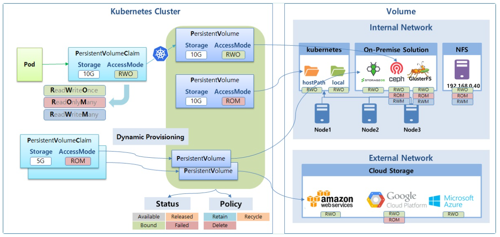
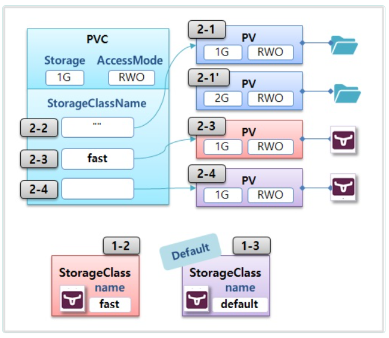
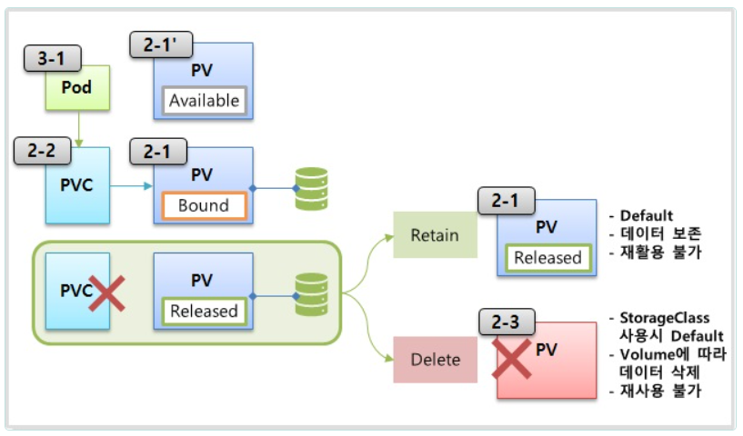
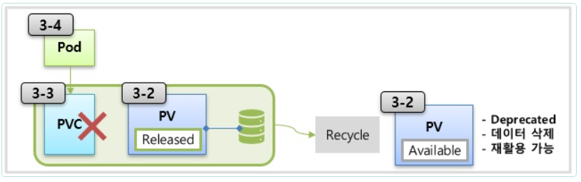

# Volume

> Dynamic Provisioning, StorageClass, Status, ReclaimPolicy

- 스토리지 솔루션 Longhorn



  ## 1. Longhorn 구축

   ### 1-1) 모든 Master/Work Node에 iscsi 설치

```bash   
yum --setopt=tsflags=noscripts install -y iscsi-initiator-utils
echo "InitiatorName=$(/sbin/iscsi-iname)" > /etc/iscsi/initiatorname.iscsi
systemctl enable iscsid
systemctl start iscsid
```

   ## 1-2) Longhorn 설치

```bash
kubectl apply -f https://raw.githubusercontent.com/kubetm/kubetm.github.io/master/yamls/longhorn/longhorn-1.5.0.yaml
```

확인

```bash
kubectl get pods -n longhorn-system
```

Longhorn Replica가 너무 많이 생성되니 줄여봅니다.
```bash
kubectl scale deploy -n longhorn-system csi-attacher --replicas=1
kubectl scale deploy -n longhorn-system csi-provisioner --replicas=1
kubectl scale deploy -n longhorn-system csi-resizer --replicas=1
kubectl scale deploy -n longhorn-system csi-snapshotter --replicas=1
kubectl scale deploy -n longhorn-system longhorn-ui --replicas=1
```

   ### 1-3) Fast StorageClass 추가

```bash
kubectl apply -f - <<END
apiVersion: storage.k8s.io/v1
kind: StorageClass
metadata:
  name: fast
provisioner: driver.longhorn.io
parameters:
  dataLocality: disabled
  fromBackup: ""
  fsType: ext4
  numberOfReplicas: "3"
  staleReplicaTimeout: "30"
END
```

   ### 1-4) StorageClass 생성 확인
```bash   
kubectl get storageclasses.storage.k8s.io

NAME                 PROVISIONER             RECLAIMPOLICY   VOLUMEBINDINGMODE      ALLOWVOLUMEEXPANSION   AGE
fast                 driver.longhorn.io      Delete          Immediate              false                  16s
longhorn (default)   driver.longhorn.io      Delete          Immediate              true                   85m
```
   ### 1-5) Dashboard 접속을 위한 Service 수정

Service Type 변경 [ClusterIP -> NodePort]
```bash
kubectl edit svc -n longhorn-system longhorn-frontend
```
```yml
  ports:
  - name: http
    port: 80
    protocol: TCP
    targetPort: http
    nodePort: 30705  # port 번호 추가
  type: NodePort      # type 변경
```

   ### 1-6) Longhorn Dashboard 접속

```code  
http://192.168.56.30:30705
```

## 2. Dynamic Provisioning




  ### 2-1) PersistentVolume

```yml
apiVersion: v1
kind: PersistentVolume
metadata:
  name: pv-hostpath1
spec:
  capacity:
    storage: 1G
  accessModes:
  - ReadWriteOnce
  hostPath:
    path: /mnt/hostpath
    type: DirectoryOrCreate
```

```yml
apiVersion: v1
kind: PersistentVolume
metadata:
  name: pv-hostpath2
spec:
  capacity:
    storage: 2G
  accessModes:
  - ReadWriteOnce
  hostPath:
    path: /mnt/hostpath
    type: DirectoryOrCreate
```

   ### 2-2) PersistentVolumeClaim 

```yml
apiVersion: v1
kind: PersistentVolumeClaim
metadata:
  name: pvc-hostpath1
spec:
  accessModes:
  - ReadWriteOnce
  resources:
    requests:
      storage: 1G
  storageClassName: ""
```
   ### 2-3) PersistentVolumeClaim
```yml
apiVersion: v1
kind: PersistentVolumeClaim
metadata:
  name: pvc-fast1
spec:
  accessModes:
  - ReadWriteOnce
  resources:
    requests:
      storage: 1G
  storageClassName: "fast"
```
   ### 2-4) PersistentVolumeClaim

```yml
apiVersion: v1
kind: PersistentVolumeClaim
metadata:
  name: pvc-default1
spec:
  accessModes:
  - ReadWriteOnce
  resources:
    requests:
      storage: 2G
```

## 3. PV Status, ReclaimPolicy



  ### 3-1) Pod

```yml
apiVersion: v1
kind: Pod
metadata:
  name: pod-hostpath1
spec:
  nodeSelector:
    kubernetes.io/hostname: k8s-node1
  terminationGracePeriodSeconds: 0
  containers:
  - name: container
    image: itwillacademy/init
    volumeMounts:
    - name: hostpath
      mountPath: /mount1
  volumes:
  - name: hostpath
    persistentVolumeClaim:
      claimName: pvc-hostpath1
```
- pod-hostpath1(Pod)의 컨테이너접속
- pod-hostpath1(Pod)의 /mount에 file.txt 파일생성

```bash
[root@pod-hostpath1 /]# cd mount1
[root@pod-hostpath1 mount1]# touch file.txt
[root@pod-hostpath1 mount1]# ls
file.txt
```

- Pod 가 node1에생성되었으므로 volume도 node1에 생성

```bash
[root@k8s-node1 /]# cd /mnt
[root@k8s-node1 mnt]# ls
hostpath
[root@k8s-node1 mnt]# cd hostpath/
[root@k8s-node1 hostpath]# ls
file.txt
[root@k8s-node1 hostpath]# 
```

Longhorn Dashboard

```
http://192.168.56.30:30705      
```



   ### 3-2) PersistentVolume
```yml
apiVersion: v1
kind: PersistentVolume
metadata:
  name: pv-recycle1
spec:
  persistentVolumeReclaimPolicy: Recycle
  capacity:
    storage: 3G
  accessModes:
  - ReadWriteOnce
  hostPath:
    path: /tmp/recycle
    type: DirectoryOrCreate
```
   ### 3-3) PersistentVolumeClaim    
```yml
apiVersion: v1
kind: PersistentVolumeClaim
metadata:
  name: pvc-recycle1
spec:
  accessModes:
  - ReadWriteOnce
  resources:
    requests:
      storage: 3G
  storageClassName: ""
```

   ### 3-4) Pod
```yml
apiVersion: v1
kind: Pod
metadata:
  name: pod-recycle1
spec:
  nodeSelector:
    kubernetes.io/hostname: k8s-node1
  terminationGracePeriodSeconds: 0
  containers:
  - name: container
    image: itwillacademy/init
    volumeMounts:
    - name: hostpath
      mountPath: /mount1
  volumes:
  - name: hostpath
    persistentVolumeClaim:
      claimName: pvc-recycle1
```
- Pod안에서 파일생성
```bash
[root@pod-recycle1 /]# cd /mount1
[root@pod-recycle1 mount1]# touch file.txt
[root@pod-recycle1 mount1]# ls
file.txt
[root@pod-recycle1 mount1]# 
```
- 노드에서 파일확인

```bash
[root@k8s-node1 /]# clear
[root@k8s-node1 /]# cd tmp
[root@k8s-node1 tmp]# ls
recycle  systemd-private-ff0736b2d73b407db8ded4e037532294-chronyd.service-fjsAPE  vagrant-shell
[root@k8s-node1 tmp]# cd recycle
[root@k8s-node1 recycle]# ls
file.txt
[root@k8s-node1 recycle]# 
```
- pod-recycle1(Pod)와 pvc-recycle1(PersistentVolumeClaim) 삭제
- pv-recycle1(PersistentVolume) 이 Available상태로된다.  


  ## kubectl

   ### Force Deletion
```bash   
kubectl delete persistentvolumeclaims pvc-fast1 --namespace=default --grace-period 0 --force
kubectl delete persistentvolume pvc-b53fd802-3919-4fb0-8c1f-02221a3e4bc0 --grace-period 0 --force
```

  ## Tips

  **hostPath**
  - Recycle 정책은 /tmp/로 시작하는 Path에서만 됨