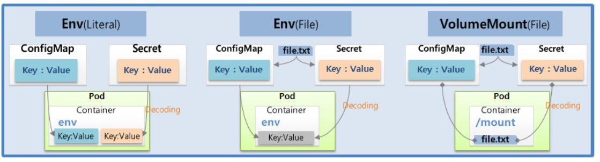
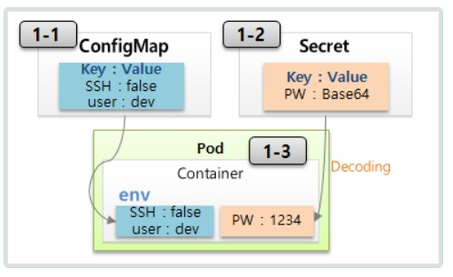
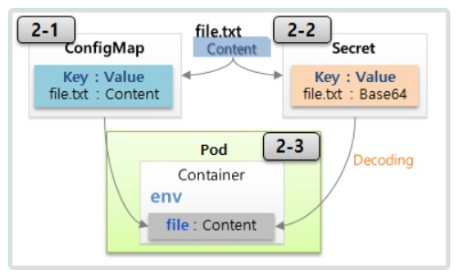
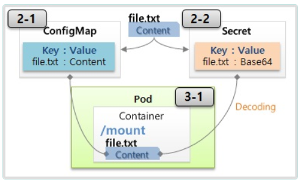

# ConfigMap, Secret

> Env(Literal, File), Mount(File)




  ## 1. Env (Literal) 

  

  ### 1-1) ConfigMap

```yaml
apiVersion: v1
kind: ConfigMap
metadata:
  name: cm-dev
data:
  SSH: 'false'
  User: dev
```

   ### 1-2) Secret

```yml
apiVersion: v1
kind: Secret
metadata:
  name: sec-dev
data:
  Key: MTIzNA==
```
  ### 1-3) Pod

```yml
apiVersion: v1
kind: Pod
metadata:
  name: pod-1
spec:
  containers:
  - name: container
    image: academyitwill/init
    envFrom:
    - configMapRef:
        name: cm-dev
    - secretRef:
        name: sec-dev
```

- pod-1의환경변수내용보기
```bash
[root@pod-1 /]# env
HOSTNAME=pod-1
SSH=false
User=dev
..
Key=1234
...

``` 


  ## 2. Env (File) 

   

   ### 2-1) Configmap

```bash
[root@k8s-master ~]# mkdir configmap
[root@k8s-master ~]# cd configmap/
[root@k8s-master configmap]# echo "Content" >> file-c.txt
[root@k8s-master configmap]# ls
file-c.txt
[root@k8s-master configmap]# cat file-c.txt
Content
[root@k8s-master configmap]#  kubectl create configmap cm-file --from-file=./file-c.txt
configmap/cm-file created
```

   ### 2-2) Secret

```bash
[root@k8s-master configmap]# echo "Content" >> file-s.txt
[root@k8s-master configmap]# kubectl create secret generic sec-file --from-file=./file-s.txt
secret/sec-file created
[root@k8s-master configmap]# ls
file-c.txt  file-s.txt
```
  ### 2-3) Pod

```yml
apiVersion: v1
kind: Pod
metadata:
  name: pod-file
spec:
  containers:
  - name: container
    image: kubetm/init
    env:
    - name: file-c
      valueFrom:
        configMapKeyRef:
          name: cm-file
          key: file-c.txt
    - name: file-s
      valueFrom:
        secretKeyRef:
          name: sec-file
          key: file-s.txt
```
```bash
[root@pod-file /]# env
file-c=Content

HOSTNAME=pod-file
...
file-s=Content
...

[root@pod-file /]# 
```

   ## 3. Volume Mount (File)

   

   ###  Pod

```yml
apiVersion: v1
kind: Pod
metadata:
  name: pod-mount
spec:
  containers:
  - name: container
    image: kubetm/init
    volumeMounts:
    - name: file-volume
      mountPath: /mount
  volumes:
  - name: file-volume
    configMap:
      name: cm-file
```

## kubectl
### **ConfigMap**

```bash
# file-c.txt 라는 파일로 cm-file라는 이름의 ConfigMap 생성
kubectl create configmap cm-file --from-file=./file-c.txt
# key1:value1 라는 상수로 cm-file라는 이름의 ConfigMap 생성
kubectl create configmap cm-file --from-literal=key1=value1
# 여러 key:value로 cm-file라는 이름의 ConfigMap 생성 
kubectl create configmap cm-file --from-literal=key1=value1 --from-literal=key2=value2
```
### **Secret Generic**

```bash
# file-s.txt 라는 파일로 sec-file라는 이름의 Secret 생성
kubectl create secret generic sec-file --from-file=./file-s.txt
# key1:value1 라는 상수로 sec-file라는 이름의 Secret 생성
kubectl create secret generic sec-file --from-literal=key1=value1
```
