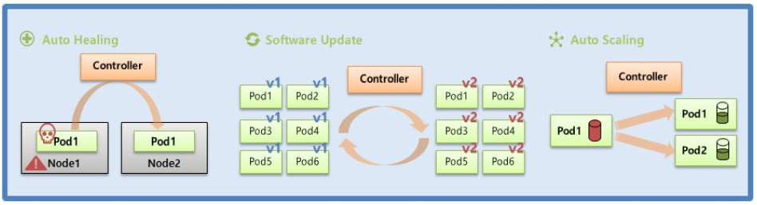
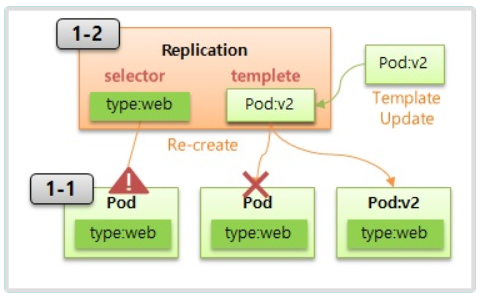
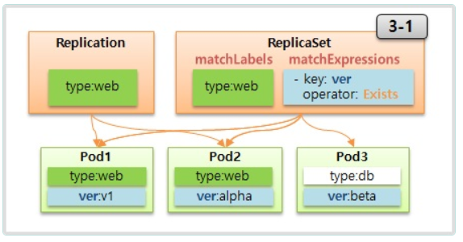
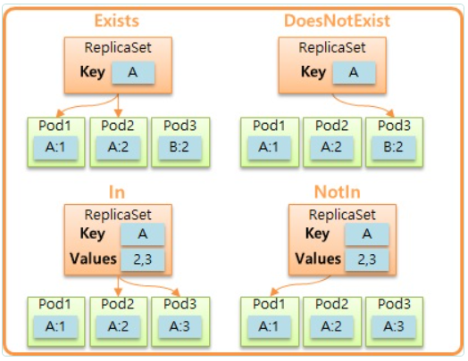

# [컨트롤러] ReplicaSet - Template, Replicas, Selector

> Template, Replicas, Selector 




  ## 1. Template, 2.Replicas 
  
  

- Template : Controller에서  Pod의 스펙을 입력하는 설정
- Replicas : Controller에 연결된 Pod의 개수를 조절하는 설정
- Pod를 먼저 생성 후 ReplicaSet.Template의 name과 selector을 일치시키면 해당 Pod와 연결됨
- 하지만 보통 ReplicaSet만 생성하고, 그럴 경우 <ReplicaSet-Name>-<Random>의 이름으로 Pod 생성됨
- Pod 삭제시 ReplicaSet이 Template의 내용을 토대로 Replicas 만큼 Pod 수를 유지함

<span style="color:red">* 해당 실습은 Template과 Replica 기능 이해를 위한 연습일 뿐입니다. 실제 생성과 관리는 다음 강의에서 배울 Deployment를 통해서 하게 되요.</span> 

   ### 1-1) Pod 

```yaml
apiVersion: v1
kind: Pod
metadata:
  name: pod1
  labels:
    type: web
spec:
  containers:
  - name: container
    image: academyitwill/app:v1
  terminationGracePeriodSeconds: 0
```

   ### 1-2) ReplicaSet

```yml
apiVersion: apps/v1
kind: ReplicaSet
metadata:
  name: replica1
spec:
  replicas: 1
  selector:
    matchLabels:
      type: web
  template:
    metadata:
      name: pod1
      labels:
        type: web
    spec:
      containers:
      - name: container
        image: academyitwill/app:v1
      terminationGracePeriodSeconds: 0
```
- replica1(ReplicaSet) 의 replicas 를 2로변경
- replica1(ReplicaSet) 수동으로  pod의버젼을 v2로 update 시키기
- replica1(ReplicaSet) 삭제시 pod도모두삭제됨


  ## 2. Updating Controller

  > ReplicationController -> ReplicaSet

  ### ReplicationController 

```yml
apiVersion: v1
kind: ReplicationController
metadata:
  name: replication1
spec:
  replicas: 2
  selector:
    cascade: "false"
  template:
    metadata:
      labels:
        cascade: "false"
    spec:
      containers:
      - name: container
        image: academyitwill/app:v1
```
   ### kubectl 

  ```bash
  [root@k8s-master ~]# kubectl delete replicationcontrollers replication1 --cascade=false
warning: --cascade=false is deprecated (boolean value) and can be replaced with --cascade=orphan.
replicationcontroller "replication1" deleted
  ``` 
   ## ReplicaSet

```yml
apiVersion: apps/v1
kind: ReplicaSet
metadata:
  name: replica2
spec:
  replicas: 2
  selector:
    matchLabels:
      cascade: "false"
  template:
    metadata:
      labels:
        cascade: "false"
    spec:
      containers:
      - name: container
        image: academyitwill/app:v1
```

  ## 3.Selector

  

   ### 3-1) ReplicaSet

```yml
apiVersion: apps/v1
kind: ReplicaSet
metadata:
  name: replica1
spec:
  replicas: 1
  selector:
    matchLabels:
      type: web
      ver: v1
  template:
    metadata:
      labels:
        type: web
        ver: v1
        ver: v2
        location: dev
    spec:
      containers:
      - name: container
        image: academyitwill/app:v1
      terminationGracePeriodSeconds: 0
```
  #### Pod 

```yml
apiVersion: v1
kind: Pod
metadata:
  name: pod-node-affinity1
spec:
  affinity:
    nodeAffinity:
      requiredDuringSchedulingIngnoredDuringExecution:
        nodeSelectorTerms:
        - matchExpressions:
  	       - {key: AZ-01, operator: Exists}
  containers:
  - name: container
    image: kubetm/init
```

  ## Tip

   ### MatchExpressions 

  


# guest ReplicaSet으로배포

> guest/guest-Deployment.yaml

```yml
apiVersion: apps/v1
kind: ReplicaSet
metadata:
  name: guest-replica1
spec:
  replicas: 2
  selector:
    matchLabels:
      app: guest
  template:
    metadata:
      name: pod-guest
      labels:
        app: guest
    spec:
      containers:
      - name: container
        image: academyitwill/guest:v1
        imagePullPolicy: Always
      terminationGracePeriodSeconds: 0
---

apiVersion: v1
kind: Service
metadata:
  name: svc-guest
spec:
  selector:
    app: guest
  ports:
  - port: 80
    targetPort: 80
    nodePort: 30001
  type: NodePort


```

```bash
[root@k8s-master ~]# mkdir guest
[root@k8s-master ~]# cd guest
[root@k8s-master guest]# vi 

 guest-ReplicaSet.yaml  내용 복사후 마우스로 붙여넣기한후
 :wq 입력후  엔터키 


# 최초 오브젝트 생성
[root@k8s-master guest]# kubectl create -f guest-ReplicaSet.yaml
# 수정후 적용
[root@k8s-master guest]# kubectl apply -f guest-ReplicaSet.yaml
# 대체
[root@k8s-master guest]# kubectl replace --force -f guest-ReplicaSet.yaml
# 삭제
[root@k8s-master guest]# kubectl delete -f guest-ReplicaSet.yaml
```

```


