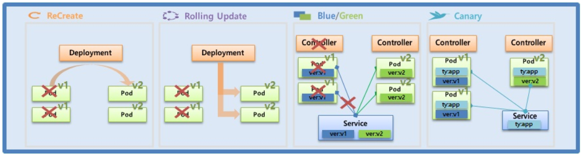
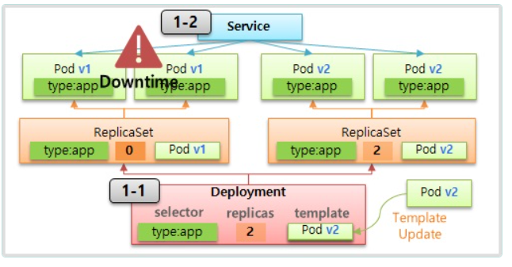
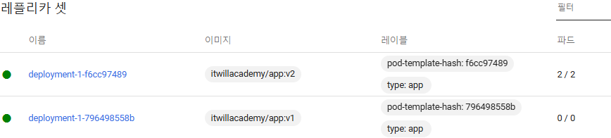
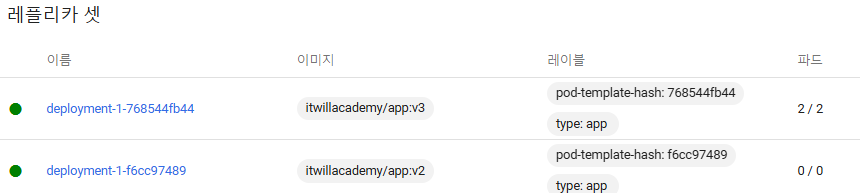
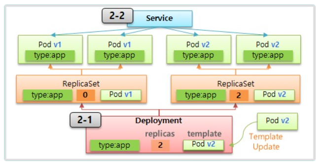

# Deployment

> Recreate, RollingUpdate



  ## 1. ReCreate
  
  

   ### 1-1) Deployment  

```yaml
apiVersion: apps/v1
kind: Deployment
metadata:
  name: deployment-1
spec:
  selector:
    matchLabels:
      type: app
  replicas: 2
  strategy:
    type: Recreate
  revisionHistoryLimit: 1
  template:
    metadata:
      labels:
        type: app
    spec:
      containers:
      - name: container
        image: itwillacademy/app:v1
      terminationGracePeriodSeconds: 10
```

   ### 1-2) Service

```yml
apiVersion: v1
kind: Service
metadata:
  name: svc-1
spec:
  selector:
    type: app
  ports:
  - port: 8080
    protocol: TCP
    targetPort: 8080
```


  ## Command 
```bash
[root@k8s-master ~]# curl 10.96.121.71:8080/version
Version : v1

[root@k8s-master ~]# while true; do curl 10.96.121.71:8080/version; sleep 1; done
Version : v1
Version : v1
...
```

- deployment-1(Deployment)의 이미지버젼 을 v1에서 v2로 변경
  - itwillacademy/app:v1 --> itwillacademy/app:v2

```bash
Version : v1
Version : v1
curl: (7) Failed to connect to 10.96.121.71 port 8080: Connection refused
curl: (7) Failed to connect to 10.96.121.71 port 8080: Connection refused
Version : v2
Version : v2

```

- revisionHistoryLimit: 1 설정에의해서 기존 Replicaset 이 1개남아있음



- deployment-1(Deployment)의 이미지버젼을 v2 에서  v3 로 변경
  - itwillacademy/app:v2 --> itwillacademy/app:v3




  ## Command
```bash
[root@k8s-master ~]# while true;do curl 20.96.36.120:8080/version;sleep 1;done
```

  ## Kubectl

```bash
  
[root@k8s-master ~]#  kubectl rollout history deployment deployment-1
deployment.apps/deployment-1 
REVISION  CHANGE-CAUSE
2         <none>
3         <none>

[root@k8s-master ~]# kubectl rollout undo deployment deployment-1 --to-revision=2
deployment.apps/deployment-1 rolled back

```

  ## 2. RollingUpdate 

  


  ### 2-1) Deployment

```yml
apiVersion: apps/v1
kind: Deployment
metadata:
  name: deployment-2
spec:
  selector:
    matchLabels:
      type: app2
  replicas: 2
  strategy:
    type: RollingUpdate
  minReadySeconds: 10
  template:
    metadata:
      labels:
        type: app2
    spec:
      containers:
      - name: container
        image: itwillacademy/app:v1
      terminationGracePeriodSeconds: 0
```


   ### 2-2) Service 

```yml
apiVersion: v1
kind: Service
metadata:
  name: svc-2
spec:
  selector:
    type: app2
  ports:
  - port: 8080
    protocol: TCP
    targetPort: 8080
```

  ### Command

```bash
[root@k8s-master ~]# while true; do curl 10.110.72.87:8080/version; sleep 1; done
Version : v1
Version : v1
..
```
- deployment-2(Deployment) 의  이미지 버젼변경
  - itwillacademy/app:v1 --> itwillacademy/app:v2


```bash
Version : v2
Version : v1
Version : v1
Version : v2
Version : v1
Version : v2

```

  ## 3. Blue/Green

   ### ReplicaSet 

```yml
apiVersion: apps/v1
kind: ReplicaSet
metadata:
  name: replica1
spec:
  replicas: 2
  selector:
    matchLabels:
      ver: v1
  template:
    metadata:
      name: pod1
      labels:
        ver: v1
    spec:
      containers:
      - name: container
        image: itwillacademy/app:v1
      terminationGracePeriodSeconds: 0
```
     
   ### Service

```yml
apiVersion: v1
kind: Service
metadata:
  name: svc-3
spec:
  selector:
    ver: v1
  ports:
  - port: 8080
    protocol: TCP
    targetPort: 8080
```
       
 ```bash
[root@k8s-master ~]#  while true; do curl 10.110.147.34:8080/version; sleep 1; done 
Version : v1
Version : v1
Version : v1
..    
 ```

- replica2(ReplicaSet) 생성
  - 이미지버젼 v2로변경(itwillacademy/app:v2) 
  - selector--> ver: v2 ,labels--> ver: v2
```yml
apiVersion: apps/v1
kind: ReplicaSet
metadata:
  name: replica2
spec:
  replicas: 2
  selector:
    matchLabels:
      ver: v2
  template:
    metadata:
      name: pod1
      labels:
        ver: v2
    spec:
      containers:
      - name: container
        image: itwillacademy/app:v2
      terminationGracePeriodSeconds: 0
```
- scv-3(Service) 객체의 selector: ver: v1--> v2 로변경

```bash
Version : v1
Version : v1
Version : v1
Version : v2
Version : v2
```