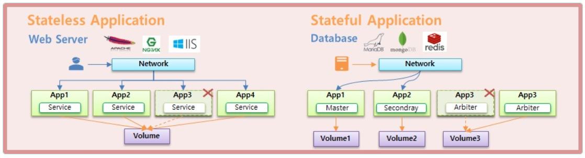
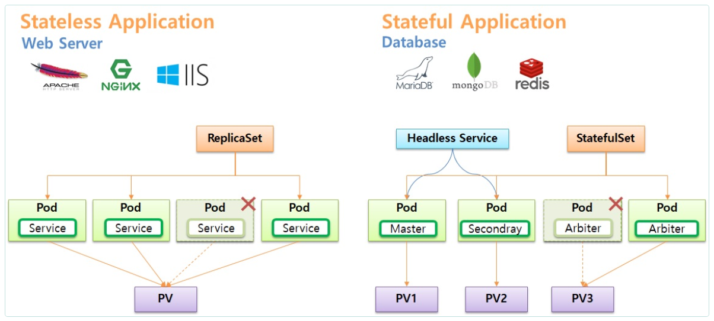
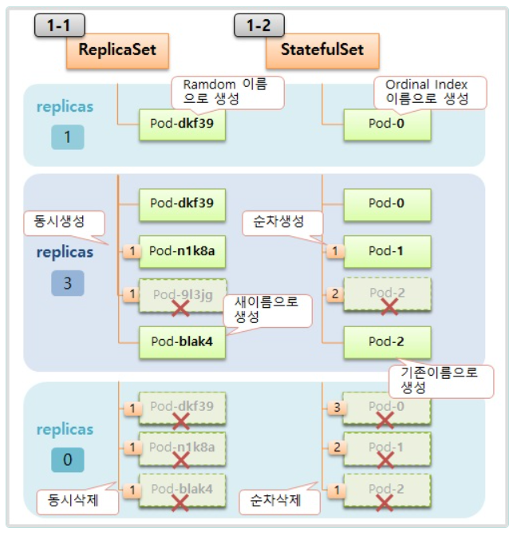
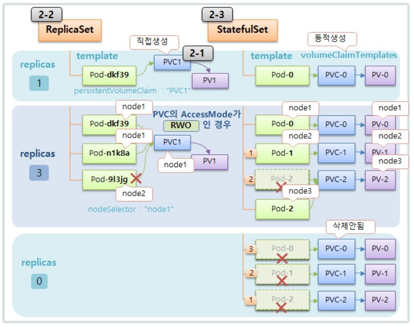
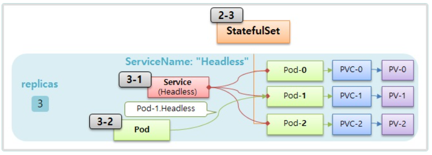

# Deployment

> Pod, PersistentVolume, Headless Service





  ## 1. StatefulSet Controller
  
  

   ### 1-1) ReplicaSet 

```yaml
apiVersion: apps/v1
kind: ReplicaSet
metadata:
  name: replica-web
spec:
  replicas: 1
  selector:
    matchLabels:
      type: web
  template:
    metadata:
      labels:
        type: web
    spec:
      containers:
      - name: container
        image: kubetm/app
      terminationGracePeriodSeconds: 10
```

   ### 1-2) StatefulSet

```yml
apiVersion: apps/v1
kind: StatefulSet
metadata:
  name: stateful-db
spec:
  replicas: 1
  selector:
    matchLabels:
      type: db
  template:
    metadata:
      labels:
        type: db
    spec:
      containers:
      - name: container
        image: kubetm/app
      terminationGracePeriodSeconds: 10
```


  ## 2. PersistentVolumeClaim 

  


  ### 2-1) PersistentVolumeClaim

```yml
apiVersion: v1
kind: PersistentVolumeClaim
metadata:
  name: replica-pvc1
spec:
  accessModes:
  - ReadWriteOnce
  resources:
    requests:
      storage: 1G
  storageClassName: "fast"
```
   ### 2-2) ReplicaSet

```yml
apiVersion: apps/v1
kind: ReplicaSet
metadata:
  name: replica-pvc
spec:
  replicas: 1
  selector:
    matchLabels:
      type: web2
  template:
    metadata:
      labels:
        type: web2
    spec:
      nodeSelector:
        kubernetes.io/hostname: k8s-node1
      containers:
      - name: container
        image: kubetm/init
        volumeMounts:
        - name: longhorn
          mountPath: /applog
      volumes:
      - name: longhorn
        persistentVolumeClaim:
          claimName: replica-pvc1
      terminationGracePeriodSeconds: 10
```
```bash
touch /applog/server.log
```


   ### 2-3) StatefulSet 

```yml
apiVersion: apps/v1
kind: StatefulSet
metadata:
  name: stateful-pvc
spec:
  replicas: 1
  selector:
    matchLabels:
      type: db2
  serviceName: "stateful-headless"
  template: 
    metadata:
      labels:
        type: db2
    spec:
      containers:
      - name: container
        image: kubetm/app
        volumeMounts:
        - name: volume
          mountPath: /applog
      terminationGracePeriodSeconds: 10
  volumeClaimTemplates:
  - metadata:
      name: volume
    spec:
      accessModes:
      - ReadWriteOnce
      resources:
        requests:
          storage: 1G
      storageClassName: "fast"
```

   ## 3. Headless Service

  

   ### 3-1) Service (Headless)

```yml
apiVersion: v1
kind: Service
metadata:
  name: stateful-headless
spec:
  selector:
    type: db2
  ports:
    - port: 80
      targetPort: 8080    
  clusterIP: None
```
     
   ### 3-2) Pod 

```yml
apiVersion: v1
kind: Pod
metadata:
  name: request-pod
spec:
  containers:
  - name: container
    image: kubetm/init
```

```bash
nslookup stateful-headless
curl stateful-pvc-0.stateful-headless:8080/hostname
```

  ## 4 Longhorn 삭제 

  자원을 많이 먹으니 실습 후 꼭 삭제해주세요

  ```bash
  kubectl delete -f https://raw.githubusercontent.com/kubetm/kubetm.github.io/master/yamls/longhorn/longhorn-1.5.0.yaml
  ```